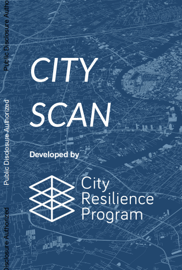

# Data Layer References

Complete reference for all data layers available in City Scan, including source datasets, resolution, and output descriptions.

## Population

Lorem ipsum dolor sit amet, consectetur adipiscing elit. Population layers are derived from WorldPop and LandScan datasets.

| Task ID | Description | Source | Resolution |
|---|---|---|---|
| `population` | Total population count per grid cell | WorldPop | 100m |
| `population_density` | People per km² | WorldPop | 100m |
| `pop_growth` | Annual population growth rate | WorldPop (multi-year) | 100m |

: Population data layers {#tbl-population}

## Land Use & Environment

```python
# Example: computing NDVI
def compute_ndvi(red_band, nir_band):
    return (nir_band - red_band) / (nir_band + red_band)
```

| Task ID | Description | Source | Resolution |
|---|---|---|---|
| `landuse` | Land use / land cover classification | Dynamic World (GEE) | 10m |
| `ndvi` | Normalized Difference Vegetation Index | Sentinel-2 | 10m |
| `ndwi` | Normalized Difference Water Index | Sentinel-2 | 10m |
| `urban_heat` | Land surface temperature | Landsat 8/9 | 30m |

: Land use and environment data layers {#tbl-environment}

## Infrastructure

Sed do eiusmod tempor incididunt ut labore et dolore magna aliqua. Infrastructure layers use OpenStreetMap as the primary source.

| Task ID | Description | Source | Resolution |
|---|---|---|---|
| `roads` | Road network density | OpenStreetMap | Vector |
| `buildings` | Building footprints & density | OpenStreetMap | Vector |
| `accessibility` | Travel time to services | OpenStreetMap + OTP | 100m |

: Infrastructure data layers {#tbl-infrastructure}

## Risk & Hazard

{fig-alt="Composite flood and seismic risk map for an example city." width="80%"}

Duis aute irure dolor in reprehenderit in voluptate velit esse cillum dolore eu fugiat nulla pariatur.

| Task ID | Description | Source | Resolution |
|---|---|---|---|
| `flood_risk` | 100-year flood extent | Fathom / MERIT Hydro | 90m |
| `coastal_erosion` | Shoreline change rate | CoastalDEM + Sentinel-1 | 30m |
| `seismic` | Peak ground acceleration | GSHAP | ~10km |

: Risk and hazard data layers {#tbl-risk}

## Adding a Custom Data Layer

```python
# Register a new task
from cityscan.registry import register_task

@register_task
class MyCustomTask:
    name = "my_custom_layer"
    inputs = ["aoi"]
    outputs = ["my_custom_layer.tif"]

    def run(self, config):
        # implementation here
        pass
```

::: {.callout-tip}
Custom tasks can be placed in the `tasks/custom/` directory and will be auto-discovered at runtime.
:::
