# Built Form

## Overview

This section examines the city's built environment by analyzing its spatial extent and expansion over time, land cover composition, road network orientation and connectivity, intersection density, and accessibility to schools and healthcare facilities. Together these layers provide a foundation for understanding how the city has grown, how its land is used, and how well it is connected internally.

----

**Data Sources**

| Dataset | Summary | Measurement | Units | Coverage |
|-----|------------|----|----|----|
| WSF® Evolution | Global settlement footprint at 30m resolution showing when land was first urbanized, from 1985 to 2015 | Year of urban expansion | Year (integer) | 1985–2015; Global |
| WSF® Tracker | Higher-resolution, more recent settlement footprint tracking urban growth from mid-2016 onward, available under private GCS access | Year of urban expansion | Fractional year (6-month intervals) | July 2016–July 2025; Global |
| WSF® Harmonized | Combined dataset merging WSF Evolution and WSF Tracker into a single continuous 1985–2025 time series using a spatial backdating algorithm | Year of urban expansion | Year | 1985–2025; Global |
| ESA WorldCover (v2.0) | Global 10m land cover product for 2021, classifying the earth's surface into 11 land cover types | Land cover class | Categorical (11 classes) | 2021; Global |
| OpenStreetMap (OSMnx) | Street network and points of interest extracted from OpenStreetMap | Road network geometry, POI locations | — | Global; extracted at time of analysis |

----

**Relevant Tasks**

```
tasks/
├── wsf/             — WSF Evolution, Tracker, and Harmonized rasters (Python)
├── landcover/       — ESA WorldCover land cover raster (GEE via Python)
├── slope/           — Terrain slope derived from elevation (Python)
└── accessibility/   — Road network, intersection density, and proximity to services (OSMnx, Python)
```

----

**Relevant Outputs**

```
mnt/{scan-id}/
├── 02-process-output/
│   ├── spatial/
│   │   ├── {city}_wsf_evolution.tif             — year of urbanization, 1985–2015 (30m)
│   │   ├── {city}_wsf_tracker.tif               — year of urbanization, 2016–2025 (10m, 6-month steps)
│   │   ├── {city}_wsf_harmonized.tif            — year of urbanization, 1985–2025 (harmonized)
│   │   ├── {city}_lc.tif                        — land cover classes (10m, categorical)
│   │   ├── {city}_network.graphml               — road network graph (OSMnx)
│   │   ├── {city}_nodes_and_edges.gpkg          — road network nodes and edges (GeoPackage)
│   │   ├── {city}_nodes_and_edges_centralities.gpkg — nodes and edges with centrality measures
│   │   ├── {city}_nodes_and_edges_accessibilities.gpkg — network with accessibility distances
│   │   ├── {city}_school_isochrone.gpkg         — school proximity isochrones
│   │   ├── {city}_health_isochrone.gpkg         — healthcare proximity isochrones
│   │   ├── {city}_osm_school.gpkg               — school POI locations from OSM
│   │   ├── {city}_osm_health.gpkg               — health facility POI locations from OSM
│   │   └── {city}_major_roads.gpkg              — primary, trunk, and motorway road segments
│   └── tabular/
│       ├── {city}_wsf_evolution.csv             — cumulative built-up area by year (1985–2015)
│       ├── {city}_wsf_tracker.csv               — cumulative built-up area by year-month (2016–2025)
│       ├── {city}_wsf_harmonized.csv            — harmonized cumulative area by year and source
│       ├── {city}_lc.csv                        — land cover pixel counts by class
│       └── {city}_network_stats.csv             — basic road network statistics
└── 03-render-output/
    ├── maps/
    │   ├── wsf.png                              — WSF Evolution choropleth (1985–2015)
    │   ├── wsf_tracker.png                      — WSF Tracker choropleth (2016–2025)
    │   ├── wsf_harmonized.png                   — WSF Harmonized choropleth (1985–2025)
    │   ├── land_cover.png                       — land cover classification map
    │   ├── intersections.png                    — intersection density raster map
    │   ├── school_points.png                    — school locations map
    │   ├── school_proximity.png                 — school proximity isochrone map
    │   ├── health_points.png                    — health facility locations map
    │   └── health_proximity.png                 — healthcare proximity isochrone map
    └── plots/
        ├── wsf-uba-plot.png                     — WSF Evolution cumulative built-up area chart
        ├── wsf-uba-tracker-plot.png             — WSF Tracker built-up area chart
        ├── wsf-uba-harmonized-plot.png          — WSF Harmonized built-up area chart
        ├── wsf-uba-separate-plot.png            — Evolution vs. Tracker sources comparison chart
        ├── wsf-growth-rate-plot.png             — Urban growth rate chart (3-year average)
        └── wsf-lc-pieplot.png                   — Land cover composition donut chart
```

----------

## Urban Extent and Change (WSF)


<!-- chart examples -->

::: { #fig-wsf-evo layout-ncol=2 layout-valign="center"}

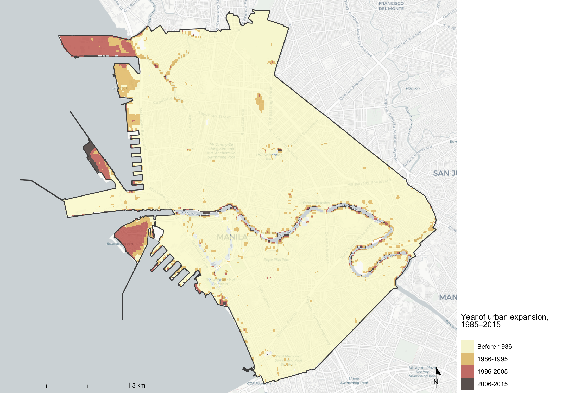{#fig-map .lightbox height=300}

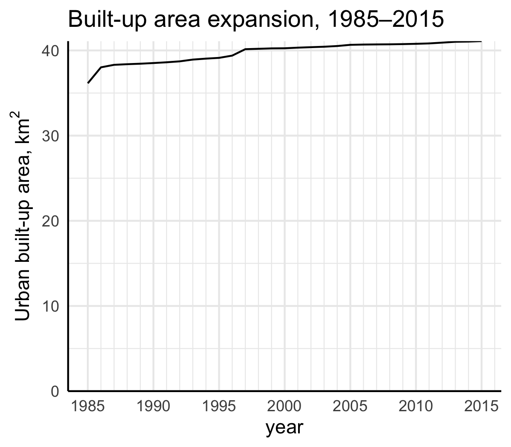{#fig-chart .lightbox height=300}

WSF Evolution
:::

::: { #fig-wsf-tracker layout-ncol=2 layout-valign="center"}

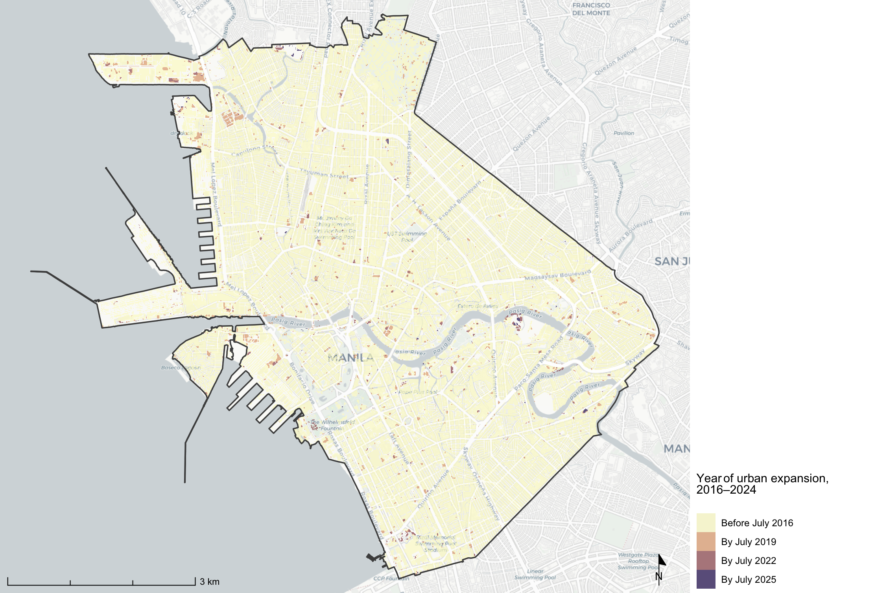{#fig-map .lightbox height=300}

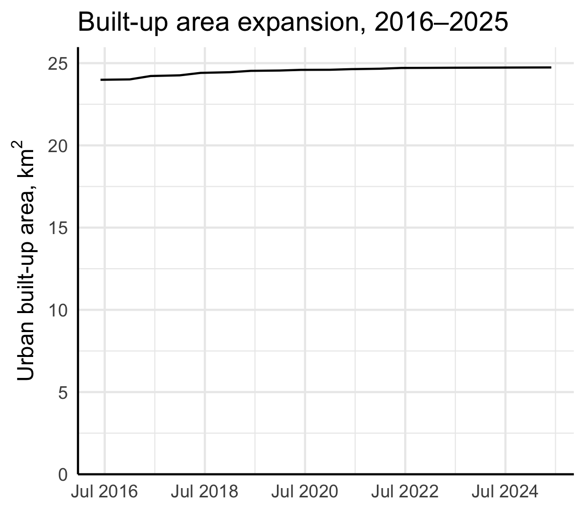{#fig-chart .lightbox height=300}

WSF Tracker
:::

::: { #fig-wsf-harmonized layout-ncol=2 layout-valign="center"}

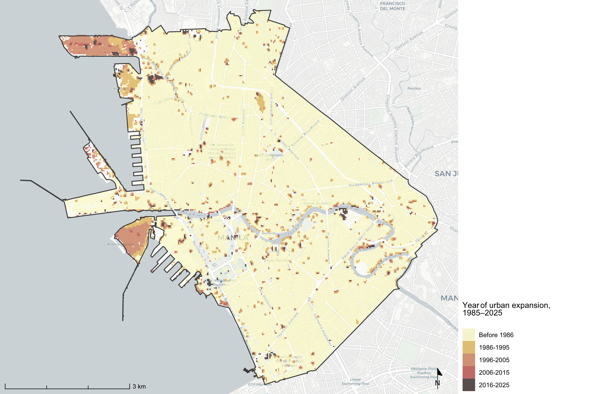{#fig-map .lightbox height=300}

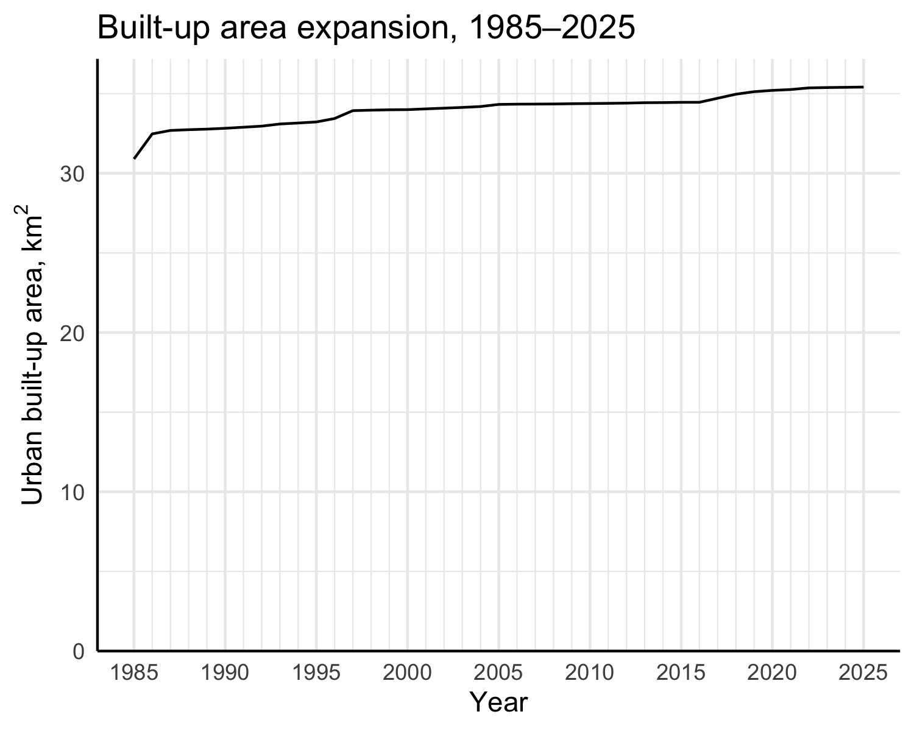{#fig-chart .lightbox height=300}

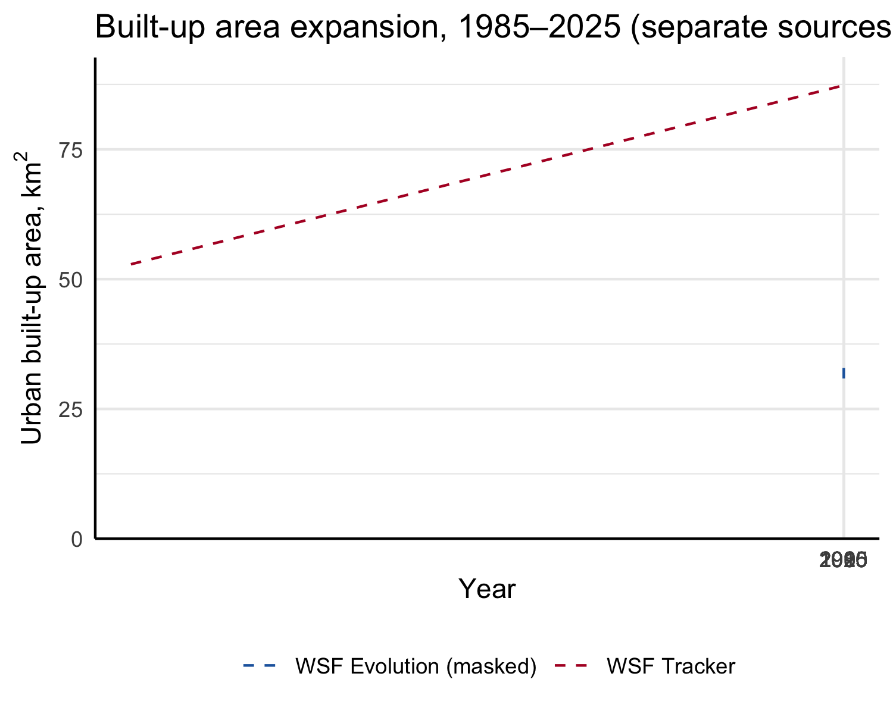{#fig-chart-separate .lightbox height=300}

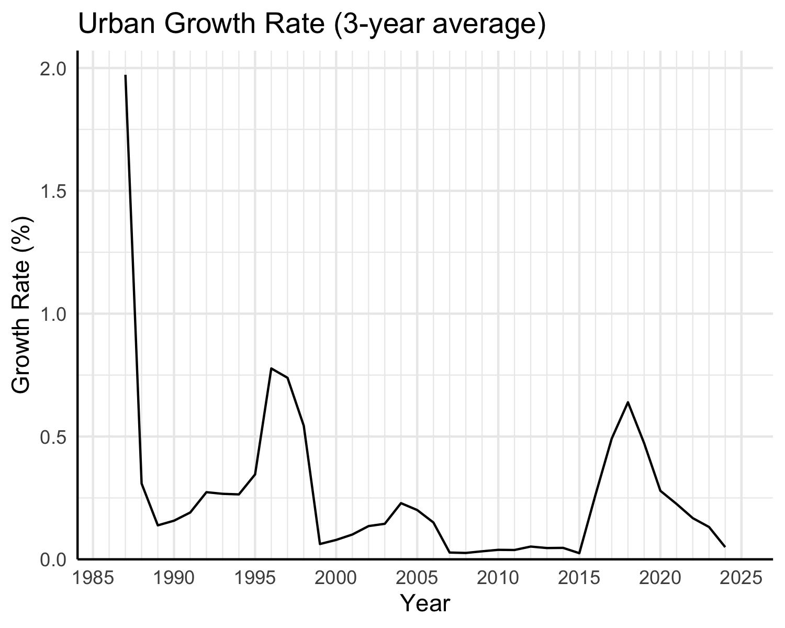{#fig-chart-growth .lightbox height=300}

WSF Harmonized
:::

| Dataset | Measurement | Units | Source | Release Year | Years of Data | Coverage | Resolution | Task |
|------------|------------|------------|------------|------------|------------|------------|------------|--------|
| WSF® Evolution | Year of urban expansion | Year | [DLR](https://geoservice.dlr.de/web/datasets/wsf_evo) | 2019 | 1985–2015 | Global | 30m | [tasks/wsf/](../tasks/wsf/) |
| WSF® Tracker | Year of urban expansion | Fractional year (6-month steps) | DLR (private GCS bucket) | Pre-release | July 2016–July 2025 | Global | 10m | [tasks/wsf/](../tasks/wsf/) |
| WSF® Harmonized | Year of urban expansion | Year | Derived from WSF Evolution + Tracker | — | 1985–2025 | Global | 30m | [tasks/wsf/](../tasks/wsf/) |


**What is it?**

Three complementary views of when land was urbanized. WSF Evolution (1985–2015, 30m) provides the historical baseline, showing the year each pixel first became a settled area using Landsat imagery. WSF Tracker (2016–2025, 10m) extends the record into the present using Sentinel-2, at higher spatial resolution and 6-month temporal granularity. WSF Harmonized combines both sources into a single seamless 1985–2025 time series using a spatial backdating algorithm that reconciles the different resolutions and sensors.

The cumulative built-up area charts translate the raster data into a time series of total urban footprint (in km²), summarizing how quickly the city has grown over each period.

**Why use it?**

Understanding where and when urban expansion occurred has direct implications for infrastructure planning, service delivery, and resilience. Areas urbanized decades ago are likely to have older building stock and may have been built before modern land use or building codes. Rapid recent expansion may indicate informal settlement growth or peri-urban sprawl. The harmonized dataset's 40-year continuous record enables analysis of long-term urbanization trajectories and changes in the rate of urban growth.

**How is this made?**

WSF Evolution was produced by the German Aerospace Center (DLR) using an iterative machine-learning approach trained on Landsat imagery, generating yearly settlement extents from 1985 to 2015. WSF Tracker uses Sentinel-2 at 10m with 6-month composites. The City Scan harmonization pipeline resamples the Tracker to 30m using modal resampling, identifies pixels that appear as 2016 settlements in the Tracker but are absent from the Evolution dataset, and uses Euclidean distance transform-based backdating to assign them plausible pre-2016 urbanization years from the nearest confirmed Evolution pixel. The remaining 2016-and-later pixels retain their Tracker year. Per-year cumulative built-up area statistics are computed in square kilometers.

**How should we interpret it?**

The maps display urbanization epochs in 5-year or 10-year ranges, revealing spatial-temporal patterns of growth. Areas shown as "Before 1986" on the Evolution map were already urbanized at the start of the record and represent the established historic core. Comparing Evolution and Tracker in the harmonized chart reveals whether the pace of urbanization has accelerated or slowed since 2016. Note that WSF does not track land that transitions back from urban to non-urban (rare but possible), and WSF Tracker tiles require private GCS access and may not be available in all deployment environments.

**Under the hood**

[`tasks/wsf/collection.py`](../tasks/wsf/collection.py) downloads 2-degree tiles: WSF Evolution tiles from DLR's public GeoService, and WSF Tracker tiles from a private GCS bucket (`/vsigs/city-scan-global-private/wsf_tracker`). Tiles are merged and clipped to the AOI. For WSF Tracker, integer mode values are converted to fractional years (mode value `i` → year `2016.0 + i × 0.5`). Harmonization is handled by `harmonize_wsf()` in [`tasks/wsf/analysis.py`](../tasks/wsf/analysis.py), which uses `scipy.ndimage.distance_transform_edt` for backdating and auto-calibrates the distance threshold at the 90th percentile of disputed-pixel distances. Cumulative area statistics are computed per year and source. Charts are rendered in R via [`tasks/wsf/charts/`](../tasks/wsf/charts/).

**Key outputs**

- `mnt/{scan-id}/02-process-output/spatial/{city}_wsf_evolution.tif` — year of urbanization, 1985–2015 (30m)
- `mnt/{scan-id}/02-process-output/spatial/{city}_wsf_tracker.tif` — year of urbanization, 2016–2025 (10m, fractional years)
- `mnt/{scan-id}/02-process-output/spatial/{city}_wsf_harmonized.tif` — harmonized year of urbanization, 1985–2025
- `mnt/{scan-id}/02-process-output/tabular/{city}_wsf_evolution.csv` — cumulative built-up area by year (1985–2015)
- `mnt/{scan-id}/02-process-output/tabular/{city}_wsf_tracker.csv` — cumulative built-up area by year and month (2016–2025)
- `mnt/{scan-id}/02-process-output/tabular/{city}_wsf_harmonized.csv` — harmonized cumulative area with source column
- `mnt/{scan-id}/03-render-output/plots/wsf-uba-plot.png` — WSF Evolution built-up area chart
- `mnt/{scan-id}/03-render-output/plots/wsf-uba-tracker-plot.png` — WSF Tracker built-up area chart
- `mnt/{scan-id}/03-render-output/plots/wsf-uba-harmonized-plot.png` — WSF Harmonized cumulative area chart
- `mnt/{scan-id}/03-render-output/plots/wsf-growth-rate-plot.png` — urban growth rate chart (3-year rolling average)

**Source data citation**

[@marconcini_understanding_2021]

----------

## Land Cover


<!-- chart examples -->

::: { #fig-lc layout-ncol=2 layout-valign="center"}

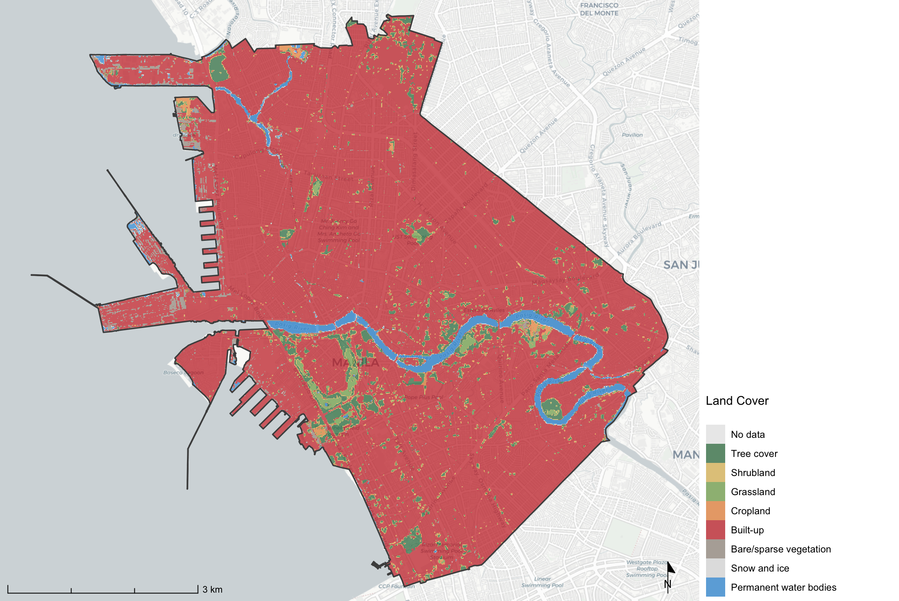{#fig-map .lightbox height=300}

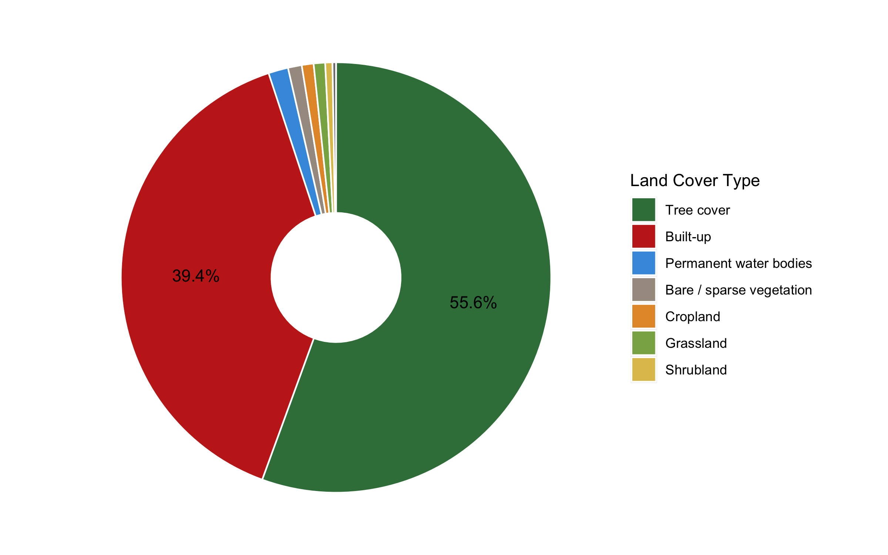{#fig-chart .lightbox height=300}

:::


| Dataset | Measurement | Units | Source | Release Year | Years of Data | Coverage | Resolution | Task |
|------------|------------|------------|------------|------------|------------|------------|------------|--------|
| ESA WorldCover v2.0 | Land cover class | Categorical (11 classes) | [European Space Agency](https://esa-worldcover.org/en) | 2021 | 2021 | Global | 10m | [tasks/landcover/](../tasks/landcover/) |


**What is it?**

A land cover classification of the city AOI at 10m resolution, derived from the ESA WorldCover v2.0 dataset for 2021. Each pixel is assigned one of 11 land cover classes: Tree cover, Shrubland, Grassland, Cropland, Built-up, Bare/sparse vegetation, Snow and ice, Permanent water bodies, Herbaceous wetland, Mangroves, and Moss and lichen. The companion donut chart shows the proportional area of each land cover class within the AOI.

**Why use it?**

Land cover composition reveals how the city's territory is divided between urban, natural, agricultural, and water areas. Understanding these proportions supports sustainable planning — identifying opportunities to protect green corridors, expand urban greenery, or assess flood risk from impervious surface coverage. Land cover also serves as a cross-reference for WSF urbanized area estimates: built-up pixels from ESA WorldCover and WSF settle surfaces should broadly align, but differences arise from varying definitions of "urban."

**How is this made?**

ESA WorldCover was produced by the European Space Agency using Sentinel-1 and Sentinel-2 data, trained against the UN FAO Land Cover Classification System. The City Scan pipeline retrieves the `ESA/WorldCover/v200` collection via Google Earth Engine, repins the raster to EPSG:3857 at 10m to preserve categorical pixel codes, and saves a clipped GeoTIFF. A post-processing step snaps any residual fractional values to the nearest valid ESA class code (10, 20, 30, ..., 100).

**How should we interpret it?**

Built-up cover indicates the share of impervious or developed land, while tree cover and grassland reflect the extent of green and natural areas. A high built-up share with limited tree cover may indicate urban heat island risk. Cropland on the urban fringe signals agricultural land potentially under pressure from urbanization. Because ESA WorldCover is based on satellite reflectance signatures and not cadastral data, some misclassifications occur — dense shade trees may be confused with forest cover, and bare construction sites may be classified as bare soil rather than built-up.

**Under the hood**

[`tasks/landcover/collection.py`](../tasks/landcover/collection.py) fetches `ESA/WorldCover/v200` from Google Earth Engine, reprojects to EPSG:3857 at 10m with nearest-neighbor resampling to preserve categorical values, and clips to the AOI. After export, pixel values are snapped to the valid ESA class code set. [`tasks/landcover/analysis.py`](../tasks/landcover/analysis.py) reads the raster in blocks using windowed reads, counts pixels per class, and writes `{city}_lc.csv`. The land cover map is rendered in R via [`core/R/`](../core/R/) using the `land_cover` layer definition in [`source/layers.yml`](../source/layers.yml). The composition chart is produced in [`tasks/landcover/charts/`](../tasks/landcover/charts/).

**Key outputs**

- `mnt/{scan-id}/02-process-output/spatial/{city}_lc.tif` — land cover raster (10m, categorical)
- `mnt/{scan-id}/02-process-output/tabular/{city}_lc.csv` — pixel count per land cover class
- `mnt/{scan-id}/03-render-output/maps/land_cover.png` — land cover classification map
- `mnt/{scan-id}/03-render-output/plots/wsf-lc-pieplot.png` — land cover composition donut chart

**Source data citation**

[@zanaga_2021_ESA_Landcover]


## Road Network and Orientation

<!-- chart examples -->

::: { #fig-road layout-ncol=2 layout-valign="center"}

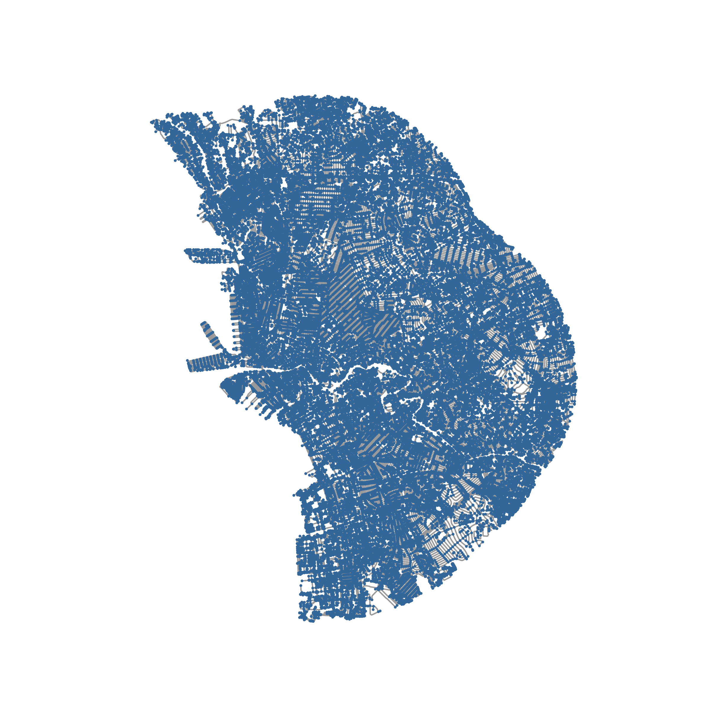{#fig-map .lightbox height=300}

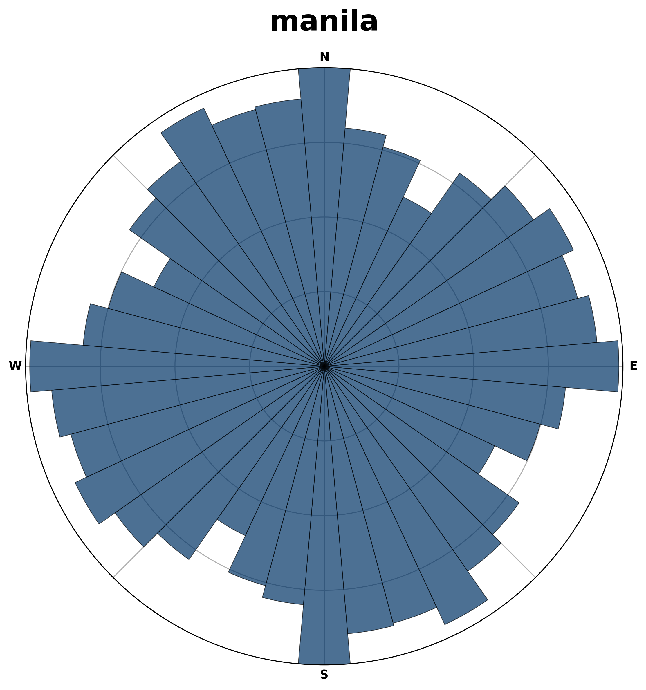{#fig-chart .lightbox height=300}

Road Network
:::


| Dataset | Measurement | Units | Source | Release Year | Years of Data | Coverage | Resolution | Task |
|------------|------------|------------|------------|------------|------------|------------|------------|--------|
| OpenStreetMap | Road network geometry | — | [OSM via OSMnx](https://geoffboeing.com/2016/11/osmnx-python-street-networks/) | Ongoing | Current snapshot | Global | — | [tasks/accessibility/](../tasks/accessibility/) |


**What is it?**

A visualization of the city's road network and a polar histogram (compass rose) showing the distribution of street bearings. Each bar in the orientation chart represents the proportion of street segments pointing in that compass direction, revealing the dominant orientations of the road grid. The road network map shows all OSM-mapped streets extracted for the city, buffered 5km beyond the AOI boundary.

**Why use it?**

Street network structure has long-term consequences for mobility, walkability, and urban resilience. A grid-dominated orientation provides route redundancy, shorter average travel distances, and more equitable access to destinations on foot or by vehicle. An organic, heterogeneous orientation reflects topography-driven or historically unplanned growth and may concentrate traffic on a limited set of routes. Understanding the road network structure informs infrastructure investment priorities, evacuation planning, and transport network resilience assessments.

**How is this made?**

The road network is extracted from OpenStreetMap using OSMnx with a 5km buffer around the AOI (`network_type='all'`). The graph is saved as both a GeoPackage (nodes and edges) and a GraphML file for fast reloading. Edge bearings are computed using `ox.add_edge_bearings()` on the undirected graph, and OSMnx's `plot_orientation()` generates the compass rose. A road network map is produced via `ox.plot_graph()`. Major roads (primary, trunk, motorway, and their links) are filtered into a separate GeoPackage.

**How should we interpret it?**

Cities built with grid-based urban planning exhibit a clear cross pattern in the compass rose, with most street bearings clustered around two perpendicular axes (e.g., Manhattan). A circular distribution with no dominant orientation reflects organic urban form, where streets follow terrain, water, or historical paths rather than a planned grid. Intermediate patterns are common in cities where a historic organic core coexists with newer planned extensions. The network map also reveals gaps — areas with sparse coverage may indicate informal settlements not yet mapped in OSM, or zones with restricted access.

**Under the hood**

[`tasks/accessibility/collection.py`](../tasks/accessibility/collection.py) downloads the graph via `ox.graph_from_polygon()`, buffering the AOI by 5km. The graph is saved as a GeoPackage and GraphML. Major roads are filtered from the edges layer using keywords (`primary`, `trunk`, `motorway`, etc.) in the `highway` attribute. The road network visualization is produced by `network_plot()` and the orientation chart by `road_orientation()`, both in [`tasks/accessibility/analysis.py`](../tasks/accessibility/analysis.py). Network statistics (node count, edge count, average node degree, circuity, etc.) are computed using `ox.stats.basic_stats()` and saved to `{city}_network_stats.csv`.

**Key outputs**

- `mnt/{scan-id}/02-process-output/spatial/{city}_network.graphml` — road network graph (for analysis reuse)
- `mnt/{scan-id}/02-process-output/spatial/{city}_nodes_and_edges.gpkg` — nodes and edges (GeoPackage)
- `mnt/{scan-id}/02-process-output/spatial/{city}_major_roads.gpkg` — primary, trunk, and motorway segments
- `mnt/{scan-id}/02-process-output/tabular/{city}_network_stats.csv` — basic network statistics
- `mnt/{scan-id}/02-process-output/images/{city}_network_plot.png` — road network visualization
- `mnt/{scan-id}/02-process-output/images/{city}_road_orientation.png` — street orientation compass rose

**Source data citation**

[@OpenStreetMap; @Boeing_2019; @osmnx_2025]

## Intersection Density

<!-- chart examples -->

::: {layout-ncol=2 layout-valign="center"}

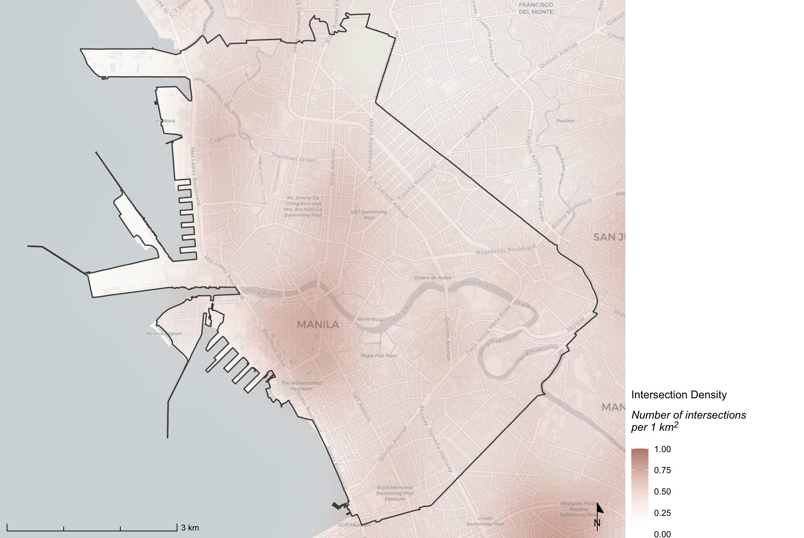{#fig-intersections .lightbox height=300}

:::

| Dataset | Measurement | Units | Source | Release Year | Years of Data | Coverage | Resolution | Task |
|------------|------------|------------|------------|------------|------------|------------|------------|--------|
| OpenStreetMap | Road intersection count per km² | Intersections per km² | [OSM via OSMnx](https://geoffboeing.com/2016/11/osmnx-python-street-networks/) | Ongoing | Current snapshot | Global | — | [tasks/accessibility/](../tasks/accessibility/) |

**What is it?**

A raster map showing the density of road intersections per square kilometer, derived from the OSM road network. Each cell represents how many intersections fall within a surrounding 1km² kernel, revealing where the network is most connected and accessible.

**Why use it?**

Intersection density is a direct measure of street network connectivity. Dense intersection patterns indicate fine-grained grids with many route options, supporting walking, cycling, and vehicle movement. Low intersection density — typically associated with cul-de-sac suburban layouts or underserved areas — forces longer travel distances and reduces route choice. Higher intersection density is associated with more walkable neighborhoods, lower vehicle-miles traveled, and more efficient emergency response.

**How is this made?**

Intersection nodes are extracted from the OSM road network graph (nodes with degree > 2). These point features are passed to `density_rast()` in [`core/R/fns-geometry.R`](../core/R/fns-geometry.R), which rasterizes the point density at 200 cells across the AOI extent and writes `intersection-density.tif`. The map is rendered in R via [`core/R/map-intersections.R`](../core/R/map-intersections.R) using the `intersections` layer definition in [`source/layers.yml`](../source/layers.yml).

**How should we interpret it?**

High-density zones correspond to the urban core or grid-planned neighborhoods where streets connect frequently. Lower-density zones on the urban periphery or in areas with large blocks, highways, or industrial estates indicate reduced connectivity. Areas with very low or zero intersection density may represent inaccessible land uses (water bodies, parks, airports) or informal zones with limited mapped street coverage.

**Under the hood**

The intersection density raster is derived from the nodes GeoPackage produced by the accessibility task. [`core/R/pre-mapping.R`](../core/R/pre-mapping.R) reads the nodes layer, computes density using `density_rast()`, and writes `intersection-density.tif` to the spatial directory if it does not already exist.

**Key outputs**

- `mnt/{scan-id}/02-process-output/spatial/intersection-density.tif` — intersection density raster (intersections per km²)
- `mnt/{scan-id}/03-render-output/maps/intersections.png` — intersection density choropleth map

**Source data citation**

[@OpenStreetMap; @osmnx_2025]

## Accessibility to Education & Healthcare

<!-- chart examples -->

::: {#fig-school layout-ncol=2 layout-valign="center"}

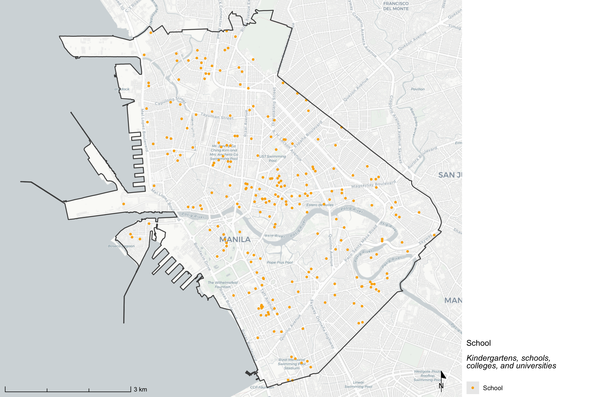{#fig-point .lightbox height=300}

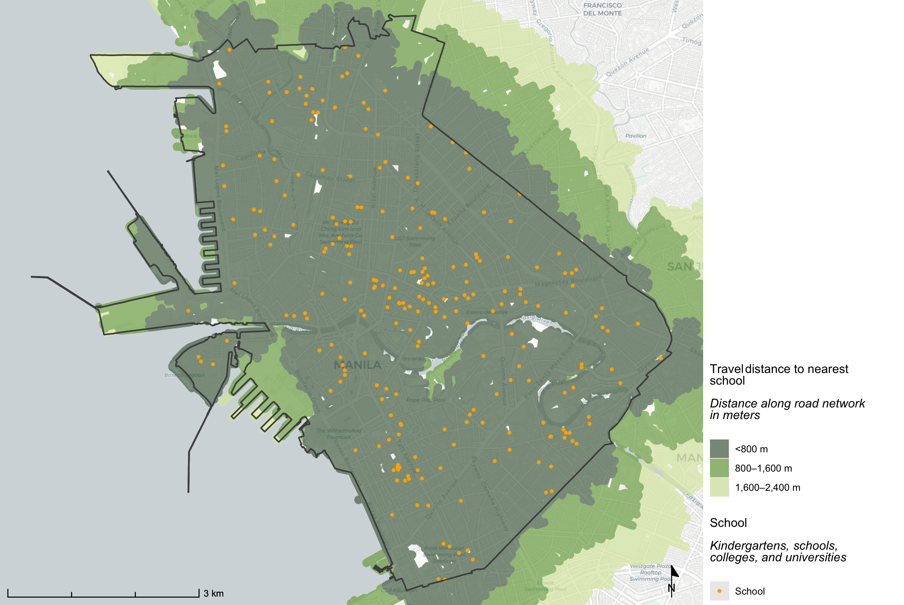{#fig-proximity .lightbox height=300}

Accessibility to education facilities
:::

::: {#fig-health layout-ncol=2 layout-valign="center"}

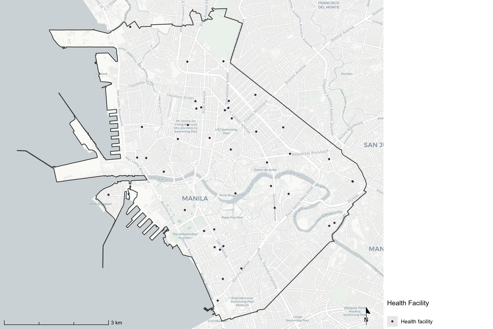{#fig-health-point .lightbox height=300}

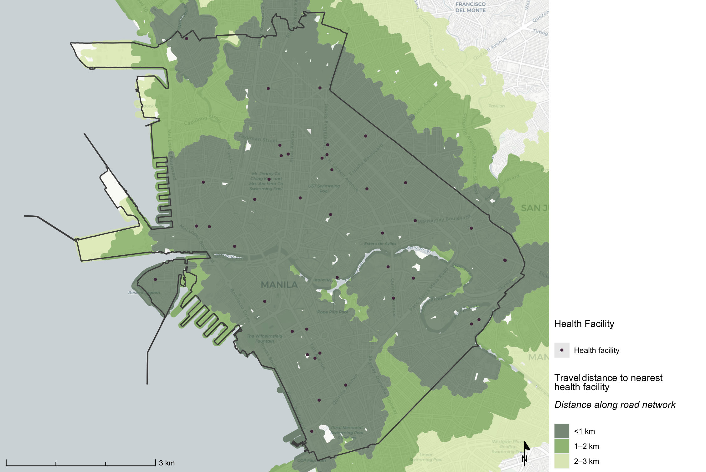{#fig-health-proximity .lightbox height=300}

Accessibility to healthcare facilities
:::


| Dataset | Measurement | Units | Source | Release Year | Years of Data | Coverage | Resolution | Task |
|------------|------------|------------|------------|------------|------------|------------|------------|--------|
| OpenStreetMap | Education facility locations | — | [OSM via OSMnx](https://geoffboeing.com/2016/11/osmnx-python-street-networks/) | Ongoing | Current snapshot | Global | — | [tasks/accessibility/](../tasks/accessibility/) |
| OpenStreetMap | Healthcare facility locations | — | [OSM via OSMnx](https://geoffboeing.com/2016/11/osmnx-python-street-networks/) | Ongoing | Current snapshot | Global | — | [tasks/accessibility/](../tasks/accessibility/) |
| OpenStreetMap | Road network geometry | — | [OSM via OSMnx](https://geoffboeing.com/2016/11/osmnx-python-street-networks/) | Ongoing | Current snapshot | Global | — | [tasks/accessibility/](../tasks/accessibility/) |

**What is it?**

Network-based isochrone maps showing which parts of the city are within recommended travel distances of the nearest school and healthcare facility, measured along the actual road network. For schools, the analysis includes all OSM features tagged as school, kindergarten, college, or university. For healthcare, it includes all features tagged as health amenity, clinic, or hospital. Facility locations are displayed as point overlays.

**Why use it?**

Access to education and healthcare is a key dimension of urban equity. Areas beyond the recommended service radius — typically 800m for schools and 1km for healthcare facilities — may face service gaps that disadvantage residents who cannot travel far by foot or lack vehicle access. Mapping these gaps visually identifies underserved zones and supports prioritization of new facilities or transport improvements.

**How is this made?**

OSM POIs are extracted for each facility category using `POI_collection()` in [`tasks/accessibility/collection.py`](../tasks/accessibility/collection.py). The network-based isochrone analysis is performed by `compute_accessibility_analysis()` in [`tasks/accessibility/analysis.py`](../tasks/accessibility/analysis.py), which calls `make_isochrone()` for each category. This function snaps each facility to the nearest road network node, computes shortest-path distances from all facility nodes to all other nodes using Dijkstra's algorithm, then generates buffered isochrone polygons at configurable distance thresholds. Thresholds are set in `inputs/city_inputs.yml` under the `isochrone` key (e.g., `[800, 1600, 2400]` meters for schools and `[1000, 2000, 3000]` for health facilities).

**How should we interpret it?**

Areas inside the innermost isochrone are well-served; areas outside the outermost isochrone mark a clear service gap. Because the analysis uses the road network rather than straight-line distance, it reflects actual travel conditions. Note that OSM coverage is incomplete in many cities — particularly informal settlements — so the absence of mapped facilities does not necessarily confirm a service gap. The facility point maps provide a visual check on coverage.

**Under the hood**

POI collections are stored as `{city}_osm_{key}.gpkg`. Isochrone polygons are saved as `{city}_{key}_isochrone.gpkg`. Accessibility distances per node are merged into `{city}_nodes_and_edges_accessibilities.gpkg` for each category. Distance thresholds and the list of facility categories are fully configurable via `inputs/city_inputs.yml`. The isochrone maps are rendered in R via [`core/R/`](../core/R/) using the `school_zones`, `school_points`, `health_zones`, and `health_points` layer definitions in [`source/layers.yml`](../source/layers.yml).

**Key outputs**

- `mnt/{scan-id}/02-process-output/spatial/{city}_osm_school.gpkg` — school POI locations from OSM
- `mnt/{scan-id}/02-process-output/spatial/{city}_osm_health.gpkg` — health facility POI locations from OSM
- `mnt/{scan-id}/02-process-output/spatial/{city}_school_isochrone.gpkg` — school isochrone polygons
- `mnt/{scan-id}/02-process-output/spatial/{city}_health_isochrone.gpkg` — healthcare isochrone polygons
- `mnt/{scan-id}/02-process-output/spatial/{city}_nodes_and_edges_accessibilities.gpkg` — network nodes/edges with distance-to-nearest-facility attributes
- `mnt/{scan-id}/03-render-output/maps/school_points.png` — school location map
- `mnt/{scan-id}/03-render-output/maps/school_proximity.png` — school proximity isochrone map
- `mnt/{scan-id}/03-render-output/maps/health_points.png` — health facility location map
- `mnt/{scan-id}/03-render-output/maps/health_proximity.png` — healthcare proximity isochrone map

**Source data citation**

[@OpenStreetMap; @osmnx_2025; @networkX]
