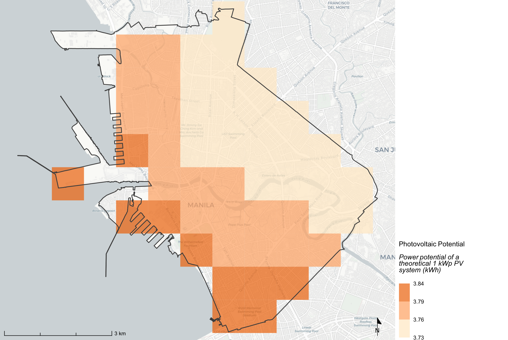
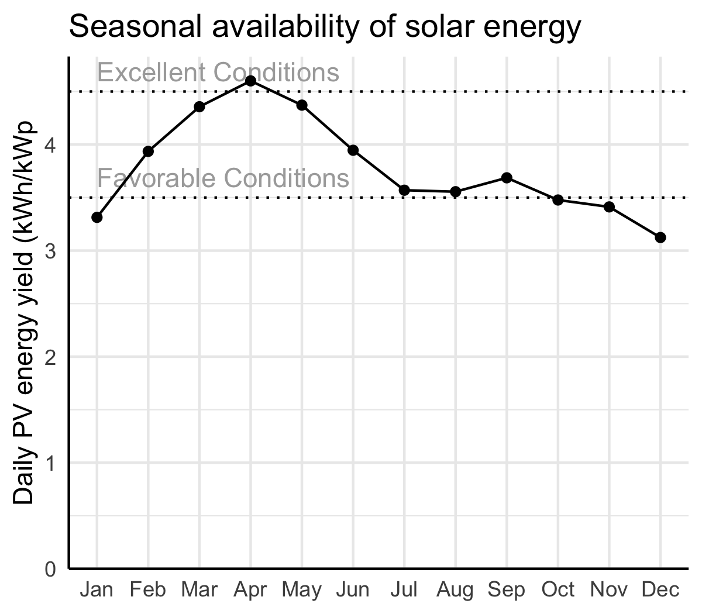
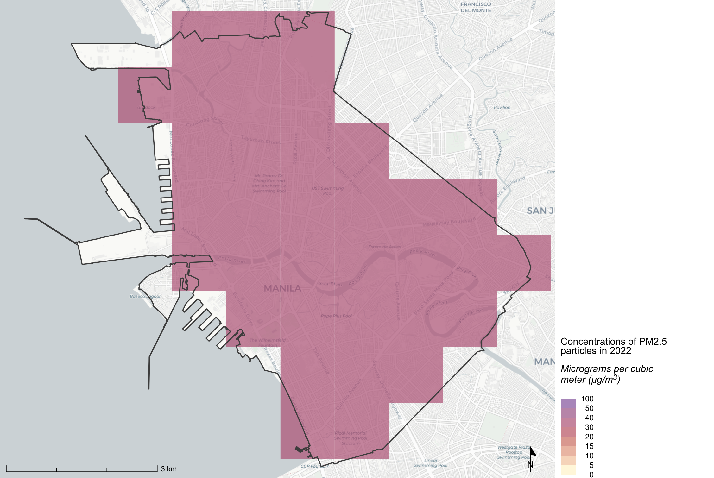
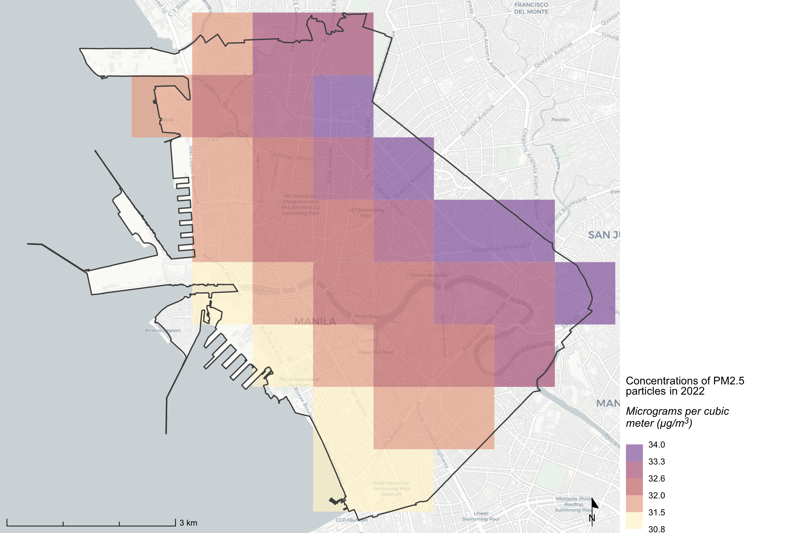
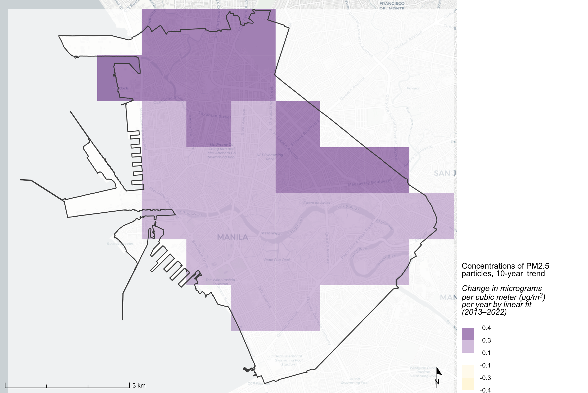
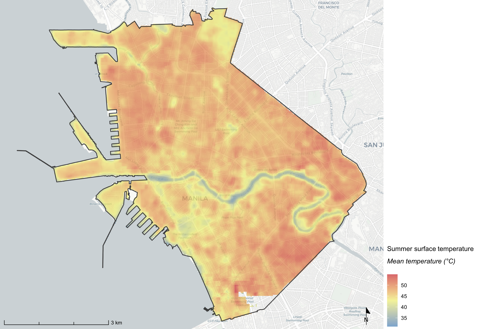
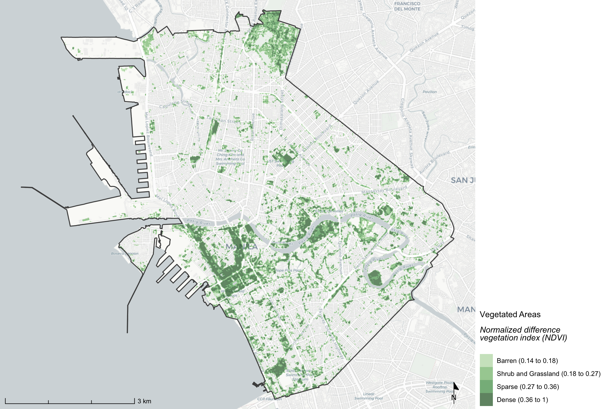
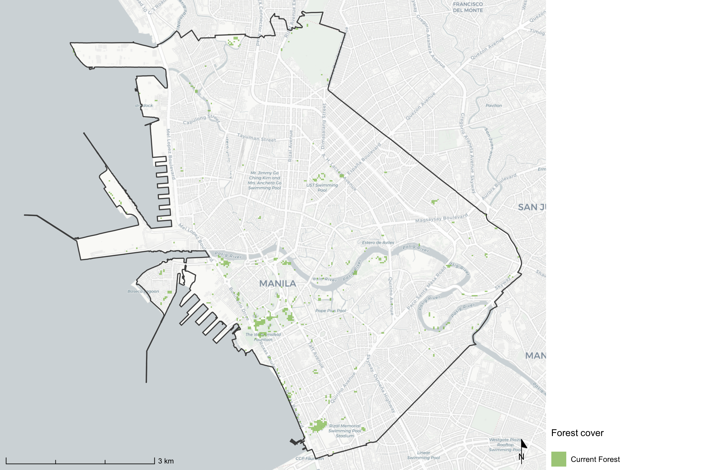
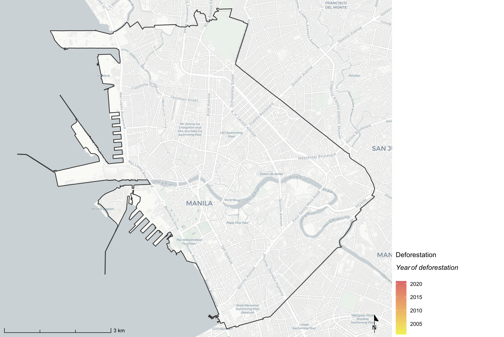

# Climate Conditions

## Overview

This section examines key climatic and environmental conditions that shape the city's livability, sustainability, and resilience. It covers solar photovoltaic potential, ambient air quality, summer land surface temperature, vegetation cover, and forest change. Together these indicators reveal the city's renewable energy opportunities, health risks from pollution, heat exposure patterns, and the state of its green and forested areas.

----

**Data Sources**

| Dataset | Summary | Measurement | Units | Coverage |
|-----|------------|----|----|----|
| Global Solar Atlas 2.0 (Solargis) | Global satellite-derived solar PV potential dataset developed for the World Bank Group by Solargis | Annual and monthly PV energy yield | kWh/kWp per day | Global; ~1994–2024 (varies by location) |
| Global Annual PM2.5 Grids v5 (SEDAC/CIESIN) | Satellite-retrieved ground-level fine particulate matter concentrations, fusing MODIS, MISR, SeaWiFS, and VIIRS aerosol optical depth data with geographically weighted regression | Annual PM2.5 concentration | µg/m³ | Global; 1998–2022 |
| Landsat 8 Collection 2, Level 2 (USGS) | Thermal infrared imagery from Landsat 8 used to derive land surface temperature | Mean summer land surface temperature | °C | Global; 2017–2024 |
| Sentinel-2 Harmonized (ESA, via GEE) | Multispectral imagery used to compute normalized difference vegetation index (NDVI) | NDVI (dimensionless, −1 to 1) | — | Global; 2017–2024 |
| Global Forest Change v1.12 (Hansen et al.) | Annual tracking of global forest cover gain and loss using Landsat satellite imagery | Forest cover (binary) and year of deforestation | Year | Global; 2000–2024 |

----

**Relevant Tasks**

```
tasks/
├── solar/        — annual and monthly photovoltaic potential (Global Solar Atlas, Python)
├── air_quality/  — PM2.5 annual concentrations, recent mean, and trend (SEDAC v5, Python)
├── lst/          — summer land surface temperature composite (Landsat 8 via GEE, Python)
├── ndxi/         — NDVI vegetation index seasonal composite (Sentinel-2 via GEE, Python)
└── forest/       — forest cover and deforestation year (Hansen et al. via GEE, Python)
```

----

**Relevant Outputs**

```
mnt/{scan-id}/
├── 02-process-output/
│   ├── spatial/
│   │   ├── {city}_solar.tif                   — annual PV potential raster (~1km)
│   │   ├── {city}_solar_monthly.tif           — 12-band monthly PV potential raster
│   │   ├── {city}_air_quality_pm2_5.tif       — multi-band PM2.5 raster (1998–2022 + summaries)
│   │   ├── {city}_lst_summer.tif              — summer mean LST raster (30m, °C)
│   │   ├── {city}_ndvi_season.tif             — seasonal NDVI raster (10m)
│   │   ├── {city}_forest_cover23.tif          — binary forest cover raster (2023, 30m)
│   │   └── {city}_deforestation.tif           — year of deforestation raster (2001–2024, 30m)
│   └── tabular/
│       ├── {city}_solar_stats.csv             — PV potential summary statistics
│       ├── {city}_solar_monthly_stats.csv     — monthly PV mean, min, max (12 months)
│       ├── {city}_pv_area.csv                 — area by PV condition bin
│       └── {city}_air_quality_pm2_5.csv       — PM2.5 per-band summary statistics
└── 03-render-output/
    ├── maps/
    │   ├── solar.png                          — PV potential choropleth map
    │   ├── air_quality.png                    — PM2.5 concentration map (global scale)
    │   ├── air_quality_local.png              — PM2.5 concentration map (local scale)
    │   ├── air_quality_trend.png              — PM2.5 trend map (2013–2022)
    │   ├── summer_lst.png                     — summer land surface temperature map
    │   ├── vegetation.png                     — NDVI vegetation density map
    │   ├── forest.png                         — current forest cover map
    │   └── deforest.png                       — deforestation year map
    └── plots/
        └── monthly-pv.png                     — seasonal PV availability line chart
```

----------

## Solar PV Potential


<!-- chart examples -->

::: { #fig-solar layout-ncol=2 layout-valign="center"}

{#fig-map .lightbox height=300}

{#fig-chart .lightbox height=300}

:::


| Dataset | Measurement | Units | Source | Release Year | Years of Data | Coverage | Resolution | Task |
|------------|------------|------------|------------|------------|------------|------------|------------|--------|
| Global Solar Atlas 2.0 | Photovoltaic power potential | kWh/kWp per day | [Solargis / World Bank](https://globalsolaratlas.info/map) | 2019 | ~1994–2024 | Global | ~1km (30 arc-sec) | [tasks/solar/](../tasks/solar/) |


**What is it?**

Solar PV potential is the estimated daily energy yield of a theoretical 1 kilowatt-peak (kWp) photovoltaic system, in kilowatt-hours per day (kWh/kWp). The annual raster shows the long-run mean yield across the city, while the seasonal chart shows how that yield varies month by month. Values above 4.5 kWh/kWp are considered excellent; values between 3.5 and 4.5 are favorable; values below 3.5 indicate below-favorable conditions.

**Why use it?**

Solar PV offers a pathway to long-term energy sustainability and resilience, especially in rapidly urbanizing cities where electricity demand is growing. Mapping spatial variation in solar potential helps identify optimal areas for rooftop or ground-mounted installations and supports planning for distributed renewable energy generation. The seasonal chart reveals how consistent the resource is throughout the year — consistent availability matters as much as peak yield for the viability of solar systems without battery storage.

**How is this made?**

The Global Solar Atlas 2.0 was developed by Solargis s.r.o. for the World Bank Group's Energy Sector Management Assistance Program (ESMAP). It draws on long-term satellite observations (covering locations back to ~1994) to derive solar irradiance and photovoltaic output estimates using atmospheric models. The annual PVOUT raster represents the mean daily PV yield at optimal tilt under 100% system availability. A separate 12-band monthly raster captures seasonal variation across January–December.

**How should we interpret it?**

Within a city, spatial variation in solar potential is typically small — differences of 0.1–0.2 kWh/kWp across the AOI are common. In practice, PV siting decisions should weight other factors more heavily than the spatial distribution shown here: roof orientation, shading from adjacent buildings or trees, and ease of maintenance. The seasonal chart is more diagnostic — systems in places with high seasonal ratios (peak-to-trough above 2:1) may require storage or grid backup to remain effective year-round. The map alone should not be the primary basis for siting decisions; it provides a baseline potential, not a deployment plan.

**Under the hood**

[`tasks/solar/collection.py`](../tasks/solar/collection.py) downloads `PVOUT.tif` (annual) and `PVOUT-monthly.tif` (12-band monthly) from the public GCS bucket and clips both to the AOI. `compute_stats()` in [`tasks/solar/analysis.py`](../tasks/solar/analysis.py) computes summary statistics from the annual raster and writes `{city}_solar_stats.csv`. `plot_solar_seasonality()` extracts per-band monthly means from the 12-band raster, writes `{city}_solar_monthly_stats.csv`, computes a seasonality interpretation (ratio of max to min monthly yield), and renders the seasonal availability chart. Area by PV condition bin (Less than Favorable / Favorable / Excellent) is written to `{city}_pv_area.csv`. The annual PV map is rendered in R via [`core/R/`](../core/R/) using the `solar` layer definition in [`source/layers.yml`](../source/layers.yml).

**Key outputs**

- `mnt/{scan-id}/02-process-output/spatial/{city}_solar.tif` — annual PV potential raster
- `mnt/{scan-id}/02-process-output/spatial/{city}_solar_monthly.tif` — 12-band monthly PV potential raster
- `mnt/{scan-id}/02-process-output/tabular/{city}_solar_stats.csv` — summary statistics (min, percentiles, mean, max)
- `mnt/{scan-id}/02-process-output/tabular/{city}_solar_monthly_stats.csv` — monthly mean, min, max per month
- `mnt/{scan-id}/02-process-output/tabular/{city}_pv_area.csv` — area share by PV condition bin
- `mnt/{scan-id}/03-render-output/maps/solar.png` — annual PV potential map
- `mnt/{scan-id}/03-render-output/plots/monthly-pv.png` — seasonal PV availability chart

**Source data citation**

Data obtained from the Global Solar Atlas 2.0, a free web-based application developed and operated by Solargis s.r.o. on behalf of the World Bank Group, utilizing Solargis data, with funding from the Energy Sector Management Assistance Program (ESMAP). For additional information: [https://globalsolaratlas.info](https://globalsolaratlas.info)

[@world_bank_group_global_2019]

----------

## Air Quality


<!-- chart examples -->

::: { #fig-air layout-ncol=2 layout-valign="center"}

{#fig-map .lightbox height=300}

{#fig-local .lightbox height=300}

{#fig-trend .lightbox height=300}

:::


| Dataset | Measurement | Units | Source | Release Year | Years of Data | Coverage | Resolution | Task |
|------------|------------|------------|------------|------------|------------|------------|------------|--------|
| Global Annual PM2.5 Grids v5 (VIIRS), v5 GL-04 | Ground-level PM2.5 annual concentration | µg/m³ | [NASA SEDAC / Columbia CIESIN](https://sedac.ciesin.columbia.edu/data/set/sdei-global-annual-gwr-pm2-5-modis-misr-seawifs-aod-v4-gl-03) | 2024 | 1998–2022 | Global | ~1.1km (36 arc-sec) | [tasks/air_quality/](../tasks/air_quality/) |


**What is it?**

Three complementary views of the city's PM2.5 air quality, all derived from the same multi-band raster:

- **Global scale map** — PM2.5 concentration for 2022 using the WHO and US EPA standard breakpoints, enabling comparison against global health benchmarks.
- **Local scale map** — same 2022 data re-classified into local quantile bins that emphasize intra-city variation.
- **Trend map** — the linear trend slope in PM2.5 from 2013 to 2022 (µg/m³ per year), showing where air quality is improving or deteriorating.

PM2.5 particles (≤2.5 µm in diameter) penetrate deep into the lungs and bloodstream. Common sources include vehicle emissions, industrial combustion, biomass burning, and dust. The WHO guideline is 5 µg/m³ annual mean; the US EPA standard is 12 µg/m³.

**Why use it?**

Chronic exposure to elevated PM2.5 is associated with cardiovascular and respiratory disease and is a leading contributor to premature mortality in urban areas. Mapping PM2.5 concentration spatially identifies neighborhoods with disproportionate pollution burden and supports prioritization of emission reduction interventions. The trend map adds a temporal dimension — an improving trend (negative slope) signals progress; a worsening trend (positive slope) flags emerging public health risk.

**How is this made?**

Annual ground-level PM2.5 estimates are derived from satellite-retrieved aerosol optical depth (AOD) measured by MODIS, MISR, SeaWiFS, and VIIRS sensors, then converted to surface concentrations using geographically weighted regression (GWR) that accounts for spatial variation in the AOD-to-PM2.5 relationship. The City Scan pipeline downloads all 25 annual rasters (1998–2022), clips to the AOI, and produces three derived summary bands: `mean_1998_2022` (long-run mean), `mean_2013_2022` (most recent 10-year mean), and `trend_2013_2022` (pixel-wise linear regression slope over 2013–2022).

**How should we interpret it?**

The global-scale map uses standard breakpoints, enabling direct comparison with health guidelines and other cities. Values consistently above 15–20 µg/m³ indicate a significant pollution burden. The local-scale map stretches the color range to the city's own distribution, making intra-city spatial patterns easier to read — but values cannot be directly compared across cities using this map. The trend map is directional: negative values indicate improving air quality, positive values indicate worsening. Note that annual averages mask seasonal extremes — events like wildfire smoke or seasonal burning can produce concentrations far above the annual mean in specific months.

**Under the hood**

[`tasks/air_quality/collection.py`](../tasks/air_quality/collection.py) downloads and clips 25 yearly PM2.5 GeoTIFFs from GCS (`sdei-global-annual-gwr-pm2-5-modis-misr-seawifs-viirs-aod-v5-gl-04-{year}-geotiff.tif` for 1998–2022) and stacks them into a single multi-band output. Three additional summary bands (`mean_1998_2022`, `mean_2013_2022`, `trend_2013_2022`) are prepended. Band descriptions are written to the GeoTIFF header. Maps are rendered in R via [`core/R/`](../core/R/) using the `air_quality`, `air_quality_local`, and `air_quality_trend` layer definitions in [`source/layers.yml`](../source/layers.yml), each reading a different band from the same raster.

**Key outputs**

- `mnt/{scan-id}/02-process-output/spatial/{city}_air_quality_pm2_5.tif` — multi-band raster (3 summary bands + 25 annual bands)
- `mnt/{scan-id}/02-process-output/tabular/{city}_air_quality_pm2_5.csv` — per-band summary statistics (max, mean, median)
- `mnt/{scan-id}/03-render-output/maps/air_quality.png` — PM2.5 map (2022, global WHO breakpoints)
- `mnt/{scan-id}/03-render-output/maps/air_quality_local.png` — PM2.5 map (2022, local quantile scale)
- `mnt/{scan-id}/03-render-output/maps/air_quality_trend.png` — PM2.5 trend map (2013–2022, µg/m³/yr)

**Source data citation**

[@ciesin2022global]

----------

## Summer Land Surface Temperature


<!-- chart examples -->

::: { layout-ncol=2 layout-valign="center"}

{#fig-sum .lightbox height=300}

:::


| Dataset | Measurement | Units | Source | Release Year | Years of Data | Coverage | Resolution | Task |
|------------|------------|------------|------------|------------|------------|------------|------------|--------|
| Landsat 8 Collection 2, Level 2 | Mean summer land surface temperature | °C | [USGS Landsat](https://www.usgs.gov/landsat-missions/landsat-collection-2-surface-temperature) | Ongoing | 2017–2024 | Global | ~30m | [tasks/lst/](../tasks/lst/) |


**What is it?**

Summer land surface temperature (LST) is the mean temperature of the ground surface — including soil, pavement, vegetation, and rooftops — measured during the three hottest months of the year, averaged across 2017–2024. LST is distinct from air temperature: it measures the thermal emission of the surface itself, not the ambient air at 1.5–2m height. Surface temperatures in densely built-up areas can exceed air temperatures by 10–20°C during heatwaves.

**Why use it?**

Extreme surface temperatures are a direct indicator of urban heat stress and its spatial distribution. Built surfaces such as asphalt and concrete absorb and retain solar radiation, generating the urban heat island effect and amplifying risk for outdoor workers, vulnerable populations, and poorly cooled housing. Mapping LST identifies which neighborhoods — typically dense, low-vegetation urban cores — experience the greatest heat burden, informing targeted greening interventions, cool surface programs, and heat action planning.

**How is this made?**

The Landsat 8 satellite's thermal infrared band (Band 10, 10.6–11.2 µm) captures the thermal emission of the land surface. The pipeline uses Landsat 8 Collection 2, Level 2, Tier 1 imagery from Google Earth Engine (`LANDSAT/LC08/C02/T1_L2`), filtered to the three hottest months of the year for each year from 2017 to 2024. Cloud and saturation pixels are masked using the QA_PIXEL and QA_RADSAT bands. Monthly mean composites are computed for the seasonal window, then averaged across years. Values are converted from Kelvin to Celsius (subtracting 273.15 °C).

**How should we interpret it?**

High-value (hot) pixels correspond to surfaces with low evapotranspiration and high thermal mass: asphalt roads, rooftops, industrial areas, and sparse-vegetation zones. Low-value (cool) pixels typically correspond to vegetated areas, water bodies, and well-shaded spaces. Because LST measures surface temperature, not ambient thermal comfort, it should be used alongside humidity and wind data for a complete heat stress assessment. LST does not directly measure the urban heat island effect (which is defined by the temperature difference between urban and surrounding rural areas at night), but it serves as a strong spatial proxy for daytime heat concentration.

**Under the hood**

[`tasks/lst/collection.py`](../tasks/lst/collection.py) builds a Landsat 8 collection filtered to the seasonal window via `fns.Composite`, applies cloud masking with `maskL8sr()`, and computes a seasonal mean composite using `comp.seasonal('summer', 'mean')`. The thermal band is scaled to Kelvin (multiply by 0.00341802, add 149.0) and converted to Celsius server-side before export via `fns.tiled_collection()` at 30m. The output is saved as `{city}_lst_summer.tif`. The LST map is rendered in R via [`core/R/`](../core/R/) using the `summer_lst` layer definition in [`source/layers.yml`](../source/layers.yml).

**Key outputs**

- `mnt/{scan-id}/02-process-output/spatial/{city}_lst_summer.tif` — summer mean LST raster (30m, °C)
- `mnt/{scan-id}/03-render-output/maps/summer_lst.png` — summer surface temperature choropleth map

**Source data citation**

[@eros2020landsat]

----------

## Green Space (NDVI)


<!-- chart examples -->

::: { layout-ncol=2 layout-valign="center"}

{#fig-ndvi .lightbox height=300}

:::


| Dataset | Measurement | Units | Source | Release Year | Years of Data | Coverage | Resolution | Task |
|------------|------------|------------|------------|------------|------------|------------|------------|--------|
| Sentinel-2 Harmonized (ESA, via GEE) | Normalized Difference Vegetation Index (NDVI) | Dimensionless (−1 to 1) | [European Space Agency / Copernicus](https://dataspace.copernicus.eu/explore-data/data-collections/sentinel-data/sentinel-2) | Ongoing | 2017–2024 | Global | 10m | [tasks/ndxi/](../tasks/ndxi/) |


**What is it?**

This map shows the density and health of vegetation using the Normalized Difference Vegetation Index (NDVI). NDVI is derived from the near-infrared (NIR) and red spectral bands of Sentinel-2 imagery:

$$NDVI = \frac{NIR - Red}{NIR + Red}$$

Values range from −1 to 1. Pixels below 0.14 indicate water, rock, or artificial surfaces. Values of 0.14–0.18 represent very sparse or barren land; 0.18–0.27 correspond to shrub and grassland; 0.27–0.36 indicate sparse vegetation; and values above 0.36 indicate dense vegetation such as urban parks, forests, or mature crops. The map represents the seasonal (summer) median composite averaged over 2017–2024.

**Why use it?**

Vegetation distribution in cities has wide-ranging implications for health, climate resilience, and environmental quality. Urban green space reduces ambient temperature through evapotranspiration, providing a natural counterpart to LST hotspots. Vegetation helps absorb rainfall and reduce surface runoff, lowering flood risk downstream. Trees and shrubs also intercept and deposit particulate matter, providing passive air quality benefits. Beyond these environmental functions, green spaces support social wellbeing — they serve as gathering places and provide mental health benefits, a role that proved especially important during the COVID-19 pandemic.^[Research on the role of urban vegetation in reducing particulate matter: <https://www.sciencedirect.com/science/article/pii/S0048969721036779>] Comparing NDVI against LST identifies areas where targeted greening could deliver maximum cooling benefit.^[On how vegetation alters local climate: <https://sustainability.stanford.edu/news/how-vegetation-alters-climate>]

**How is this made?**

Sentinel-2 Harmonized imagery (`COPERNICUS/S2_HARMONIZED`) is filtered to scenes with less than 10% cloud cover for the summer season of each year (2017–2024). Cloud pixels are masked using the QA60 band. Median composites are computed per season, and NDVI is calculated server-side as `(B8 − B4) / (B8 + B4)`, using Band 8 (NIR, 780–885 nm) and Band 4 (Red, 650–860 nm).^[Sentinel-2 captures 13 bands; NDVI uses bands 4 and 8, both at 10m resolution. See <https://custom-scripts.sentinel-hub.com/custom-scripts/sentinel-2/ndvi/>.] Both bands have a native resolution of 10m. The resulting seasonal NDVI composite is exported at 10m and saved as `{city}_ndvi_season.tif`.

**How should we interpret it?**

NDVI captures both vegetation density and vegetation health at a given point in time. Because the map shows a seasonal median, it reflects peak-green conditions for summer — areas with seasonal deciduous vegetation may appear greener than their year-round average. NDVI does not distinguish between different vegetation types, so a dense urban park and a productive crop field with similar canopy structure would show similar values. NDVI also does not capture the social accessibility or quality of green spaces — high NDVI areas may be private gardens or industrial green buffers inaccessible to the public.

**Under the hood**

[`tasks/ndxi/collection.py`](../tasks/ndxi/collection.py) builds a Sentinel-2 collection filtered to the seasonal window and cloud fraction threshold, applies the QA60-based cloud mask via `maskS2clouds()`, and computes the median seasonal composite. NDVI is computed server-side and exported via `fns.tiled_collection()` at 10m. The output is saved as `{city}_ndvi_season.tif`. The vegetation map is rendered in R via [`core/R/`](../core/R/) using the `vegetation` layer definition in [`source/layers.yml`](../source/layers.yml), which applies fixed NDVI breakpoints.

**Key outputs**

- `mnt/{scan-id}/02-process-output/spatial/{city}_ndvi_season.tif` — seasonal NDVI composite raster (10m)
- `mnt/{scan-id}/03-render-output/maps/vegetation.png` — NDVI vegetation density map

**Source data citation**

[@esa2020ndvi]

----------

## Forests & Deforestation


<!-- chart examples -->

::: {#fig-forest layout-ncol=2 layout-valign="center"}

{#fig-forest-map .lightbox height=300}

{#fig-deforest-map .lightbox height=300}

Forests and Deforestation
:::


| Dataset | Measurement | Units | Source | Release Year | Years of Data | Coverage | Resolution | Task |
|------------|------------|------------|------------|------------|------------|------------|------------|--------|
| Global Forest Change v1.12 (Hansen et al.) | Forest cover (binary) and year of deforestation | Year (integer, 1–24 for 2001–2024) | [University of Maryland / GEE](https://glad.earthengine.app/view/global-forest-change) | 2024 | 2000–2024 | Global | 30m | [tasks/forest/](../tasks/forest/) |


**What is it?**

Two complementary maps of the city's forest status. The **forest cover map** shows current tree cover — specifically, areas where at least 20% of a 30m×30m pixel was covered by tree canopy of 5 metres or more in 2000 and that has not been lost by 2023 (with gain areas from 2000–2012 included). The **deforestation map** shows the year that each forested pixel experienced tree cover loss (encoded as 1–24 for 2001–2024).

**Why use it?**

Forests provide a range of ecosystem services with direct implications for urban resilience: they regulate the local water cycle through evapotranspiration, reduce surface runoff and flood risk, stabilize soils on slopes and riverbanks, sequester carbon, and filter air pollutants. Tracking deforestation identifies where these services are being eroded and may signal expanding agricultural use, land clearing for urban development, or wildfire activity. At the peri-urban fringe, deforestation pressure often correlates with informal settlement expansion.

**How is this made?**

The Hansen et al. Global Forest Change dataset is produced at the University of Maryland using Landsat time-series imagery. Areas of vegetation are first detected using red and near-infrared bands, then filtered by height — pixels with ≥20% tree cover at ≥5m height are classified as forest. The dataset provides a 2000 baseline tree cover map plus annual layers of forest loss (2001–2024) and a 2000–2012 forest gain map. The City Scan pipeline derives two outputs: a current forest cover raster for approximately 2023 (starting from the 2000 baseline, subtracting loss through 2023, adding gain), and a deforestation year raster encoding when each loss pixel occurred.

**How should we interpret it?**

The forest cover map shows where trees currently exist, not whether the land is legally designated as forest. Urban parks and tree-lined streets with sufficient canopy density may appear as forested. The deforestation map reveals the spatial and temporal pattern of loss — clusters of loss in the same year may indicate clearing events or fire episodes; scattered annual loss may reflect gradual encroachment. As with all global remote sensing products, accuracy varies by forest type and canopy structure; tropical forests tend to have higher detection accuracy than sparse dryland woodlands.

**Under the hood**

[`tasks/forest/collection.py`](../tasks/forest/collection.py) loads the Hansen GFC v1.12 image (`UMD/hansen/global_forest_change_2024_v1_12`) from Google Earth Engine. Current forest cover is derived as: `forestCover2000 (≥20%) − lossThrough2023 + gain2000-2012 ≥ 1`. The binary forest cover and the deforestation year (`lossyear`) bands are each exported via `fns.tiled_collection()` at 30m with nearest-neighbor resampling to preserve discrete values. Both rasters are saved as `int8` and `int16` respectively with nodata=0. Forest and deforestation maps are rendered in R via [`core/R/`](../core/R/) using the `forest` and `deforest` layer definitions in [`source/layers.yml`](../source/layers.yml).

**Key outputs**

- `mnt/{scan-id}/02-process-output/spatial/{city}_forest_cover23.tif` — binary forest cover raster (~2023, 30m)
- `mnt/{scan-id}/02-process-output/spatial/{city}_deforestation.tif` — year of deforestation raster (2001–2024, 30m)
- `mnt/{scan-id}/03-render-output/maps/forest.png` — current forest cover map
- `mnt/{scan-id}/03-render-output/maps/deforest.png` — deforestation year map

**Source data citation**

[@hansenetal2013]
