# Economic Activity

## Overview

This section presents key economic indicators for the city, drawing on multiple complementary data sources: nighttime lights radiance as a proxy for local economic activity and change, gridded GDP rasters for spatially distributed output measures, and the Oxford Economics Global Cities Database for city-level time series on GDP, employment, gross value added, and household income.

---

**Data Sources**

| Dataset | Summary | Measurement | Units | Coverage |
|----|---------|---|---|---|
| VIIRS Nighttime Lights (VCMSLCFG) | Monthly average nighttime radiance composites, used as a proxy for economic activity and its change over time | Radiance sum / linear trend slope | nW/cm²/sr | 2013–near real time (City Scan uses most recent 10 years) |
| Gridded Global GDP (1990–2022) | Downscaled GDP from admin-2 level data using machine learning, at ~1km and ~10km resolution | Total GDP and GDP per capita | Million USD (PPP, 2017 USD) / USD per capita (PPP, 2017 USD) | 1990–2020 (total, every 5 years); 1990–2022 (per capita) |
| SectGDP30 | Spatially distributed sectoral GDP maps generated by disaggregating sub-national GDP statistics using land-use and population data | GDP by sector (agriculture, industry, services) | Thousand USD (nominal) | 2010, 2015, 2020 |
| Oxford Economics Global Cities Database | City-level economic aggregates harmonized to consistent functional urban area definitions | GDP, GDP per capita, employment, GVA, household income | Multiple (USD, persons, %) | 2000–2040 |

---

**Relevant Tasks**

```
tasks/
├── nightlight/      — nighttime lights radiance and trend (VIIRS via Google Earth Engine)
├── gdp_gridded/     — total GDP and GDP per capita rasters (gridded global data, R)
├── gdp_sectoral/    — sectoral GDP rasters by land-use disaggregation (SectGDP30, Python)
└── oxford/          — city-level GDP, employment, GVA, and household income (Oxford Economics, R)
```

---

**Relevant Outputs**

```
mnt/{scan-id}/
├── 02-process-output/
│   ├── spatial/
│   │   ├── {city}_avg_rad_sum.tif          — cumulative nighttime radiance (last 10 years, ~464m)
│   │   ├── {city}_linfit.tif               — linear trend slope in nighttime radiance (~464m)
│   │   ├── {city}_gdp_total.tif            — multi-band total GDP (1990–2020, 30 arc-sec)
│   │   ├── {city}_gdp_per_capita.tif       — multi-band GDP per capita (1990–2022, 5 arc-min)
│   │   ├── {city}_gdp_agriculture.tif      — 3-band sectoral GDP: agriculture (2010, 2015, 2020)
│   │   ├── {city}_gdp_industry.tif         — 3-band sectoral GDP: industry (2010, 2015, 2020)
│   │   ├── {city}_gdp_service.tif          — 3-band sectoral GDP: services (2010, 2015, 2020)
│   │   └── {city}_gdp_combined.tif         — 3-band combined GDP, all sectors (2010, 2015, 2020)
│   └── tabular/
│       ├── {city}_oxford_gdp.csv               — Oxford total GDP time series (2000–2021)
│       ├── {city}_oxford_gdp_growth.csv        — Oxford GDP year-over-year growth %
│       ├── {city}_oxford_gdppc.csv             — Oxford GDP per capita snapshot (2021)
│       ├── {city}_oxford_gdppc_timeseries.csv  — Oxford GDP per capita time series
│       ├── {city}_oxford_emp.csv               — Oxford total employment time series
│       ├── {city}_oxford_emp_growth.csv        — Oxford employment year-over-year growth %
│       ├── {city}_oxford_emp_sectors.csv       — Oxford employment share by sector (2021)
│       ├── {city}_oxford_gva_sectors.csv       — Oxford GVA share by sector (2021)
│       ├── {city}_oxford_incomes.csv           — Household income distribution (simplified bands)
│       └── {city}_oxford_incomes_all.csv       — Household income distribution (all income bands)
└── 03-render-output/
    ├── maps/
    │   ├── economic_activity.png           — nighttime radiance sum choropleth
    │   ├── economic_change.png             — nighttime radiance trend choropleth
    │   ├── gdp_total.png                   — total GDP (2020) raster map
    │   ├── gdp_per_capita.png              — GDP per capita (2022) raster map
    │   ├── gdp_combined.png                — combined sectoral GDP (2020) raster map
    │   ├── gdp_agriculture.png             — agricultural GDP (2020) raster map
    │   ├── gdp_industry.png                — industrial GDP (2020) raster map
    │   └── gdp_service.png                 — services GDP (2015) raster map
    └── plots/
        ├── oxford-gdp-line.png                  — Oxford GDP time series vs. benchmark cities
        ├── oxford-gdp-per-capita.png            — Oxford GDP per capita comparison (2021)
        ├── oxford-gdp-per-capita-line.png       — Oxford GDP per capita time series
        ├── oxford-emp-line.png                  — Oxford employment time series
        ├── oxford-employment-sectors.png        — Oxford employment share by sector
        ├── oxford-gva-sectors.png               — Oxford GVA share by sector
        ├── oxford-household-incomes-bar.png     — Household income distribution (2021)
        └── oxford-household-incomes-area.png    — Household income distribution over time
```

--------

## Economic Hotspots


<!-- chart examples -->
::: {layout-ncol=2}
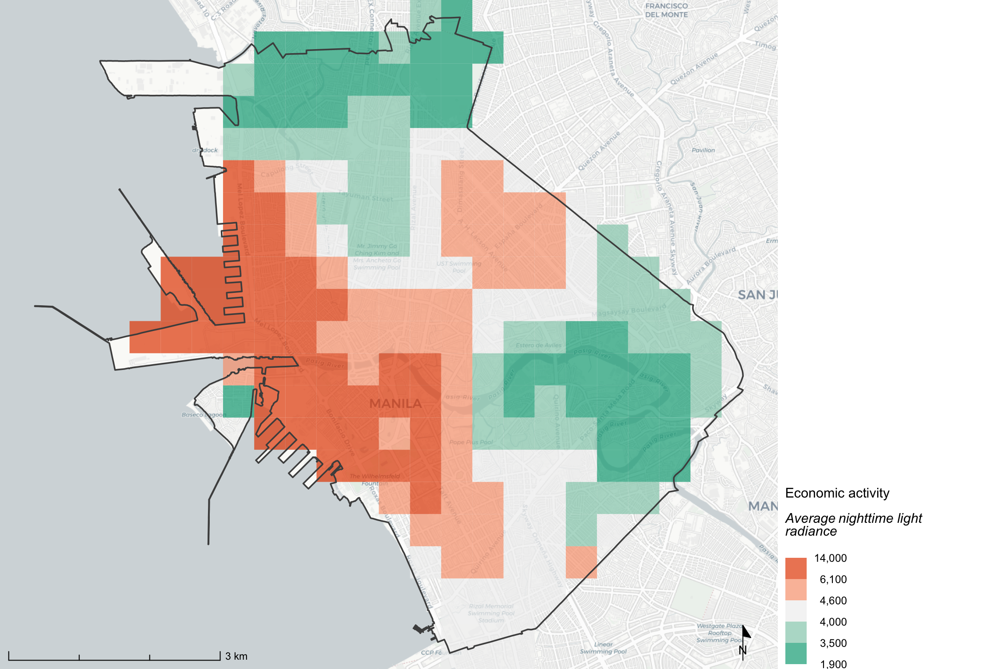{#fig-econ-activity .lightbox}
:::

| Dataset | Measurement | Units | Source | Release Year | Years of Data | Coverage | Resolution | Task |
|---------|---------|---------|---------|---------|---------|---------|---------|------|
| VIIRS Stray Light Corrected Nighttime Day/Night Band Composites Version 1 | Sum of monthly average nighttime radiance | nW/cm²/sr | [NASA Earthdata](https://earthdata.nasa.gov/earth-observation-data/near-real-time/download-nrt-data/viirs-nrt) | Ongoing | 2013–near real time; City Scan uses most recent 10 years | Global | ~464m | [tasks/nightlight/](../tasks/nightlight/) |

**What is it?**

A map of cumulative nighttime light radiance aggregated over the most recent 10 years of VIIRS observations. Nighttime lights are a widely used proxy for economic activity: brighter areas indicate more artificial light from commercial, industrial, and residential activity. Higher values correspond to areas of greater sustained economic intensity.

**Why use it?**

Nighttime lights data is available globally and consistently, making it especially valuable in cities or regions where economic statistics are scarce or unreliable. VIIRS captures imagery at approximately 01:30 local time, which reduces interference from transient sources. Unlike aggregate GDP statistics, this dataset can be disaggregated to sub-city resolution, allowing identification of economically active neighborhoods — including informal economic activity not captured in official records.

**How is this made?**

VIIRS monthly composites are filtered to the most recent 10-year period using Google Earth Engine. Monthly `avg_rad` images are summed across all available months in the window, producing a single raster of cumulative nighttime radiance. The result is clipped to the AOI and exported at the dataset's native scale (~464m).

**How should we interpret it?**

Areas of higher cumulative radiance should be interpreted as indicators of sustained economic activity, not a precise measure of output. Caveats apply: certain land uses (e.g., gas stations, airports, industrial zones) emit disproportionate light relative to their economic footprint, while daytime-oriented markets may show little nighttime signal. Use this map to identify spatial patterns and concentrate analysis rather than to read off absolute values.

**Under the hood**

[`tasks/nightlight/`](../tasks/nightlight/) fetches the VIIRS monthly composite collection from Google Earth Engine (`NOAA/VIIRS/DNB/MONTHLY_V1/VCMSLCFG`), filters to the most recent 10-year window, and reduces the collection to a cumulative sum (`avg_rad_sum`). The raster is exported via `fns.tiled_collection()` at 463.83m and saved to `spatial/`. The choropleth map is rendered in R via [`core/R/`](../core/R/) using the `economic_activity` layer definition in [`source/layers.yml`](../source/layers.yml).

**Key outputs**

- `mnt/{scan-id}/02-process-output/spatial/{city}_avg_rad_sum.tif` — cumulative radiance sum raster (~464m)
- `mnt/{scan-id}/03-render-output/maps/economic_activity.png` — nighttime radiance choropleth map

**Source data citation**

[@mills2013viirs]

--------

## Economic Change

::: {layout-ncol=2}
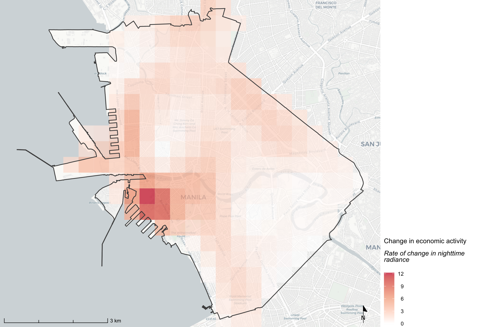{#fig-econ-change .lightbox}
:::


| Dataset | Measurement | Units | Source | Release Year | Years of Data | Coverage | Resolution | Task |
|---------|---------|---------|---------|---------|---------|---------|---------|------|
| VIIRS Stray Light Corrected Nighttime Day/Night Band Composites Version 1 | Linear trend slope of monthly average radiance over time | nW/cm²/sr per year | [NASA Earthdata](https://earthdata.nasa.gov/earth-observation-data/near-real-time/download-nrt-data/viirs-nrt) | Ongoing | 2013–near real time; City Scan uses most recent 10 years | Global | ~464m | [tasks/nightlight/](../tasks/nightlight/) |

**What is it?**

A map showing the direction and rate of change in nighttime radiance over the most recent 10 years. Positive values indicate locations where nighttime light intensity has been increasing over time — a signal of economic expansion or new development. Negative values indicate areas where radiance has declined.

**Why use it?**

Where economic activity is stable, the static radiance sum (Economic Hotspots) is sufficient. Economic Change adds a temporal dimension, revealing which parts of the city are growing, stagnating, or declining in economic intensity. This is useful for identifying emerging economic corridors, areas of disinvestment, or zones affected by major events such as industrial closures or conflict.

**How is this made?**

The same VIIRS monthly composite collection used for Economic Hotspots is used here. A linear regression is fitted to the time series of `avg_rad` values at each pixel, using the image timestamp as the independent variable via `ee.Reducer.linearFit()`. The resulting `scale` band — the slope of the trend line — is exported as the economic change raster.

**How should we interpret it?**

Strongly positive values indicate locations experiencing consistent growth in nighttime radiance, which may reflect new development, commercial expansion, or infrastructure investment. Strongly negative values may indicate economic decline, depopulation, or infrastructure damage. Values near zero represent stable or negligible change. The same caveats as Economic Hotspots apply: nighttime radiance is a proxy, not a direct measure of output.

**Under the hood**

[`tasks/nightlight/`](../tasks/nightlight/) applies `ee.Reducer.linearFit()` to the time-stamped VIIRS collection, fitting a pixel-wise linear model over the 10-year window. The `scale` band of the result (the regression slope) is exported via `fns.tiled_collection()` at 463.83m and saved as `{city}_linfit.tif`. The choropleth map is rendered in R via [`core/R/`](../core/R/) using the `economic_change` layer definition in [`source/layers.yml`](../source/layers.yml).

**Key outputs**

- `mnt/{scan-id}/02-process-output/spatial/{city}_linfit.tif` — linear radiance trend slope raster (~464m)
- `mnt/{scan-id}/03-render-output/maps/economic_change.png` — radiance trend choropleth map

**Source data citation**

[@mills2013viirs]

--------

## GDP Total & GDP per Capita (PPP)

::: {layout-ncol=2}
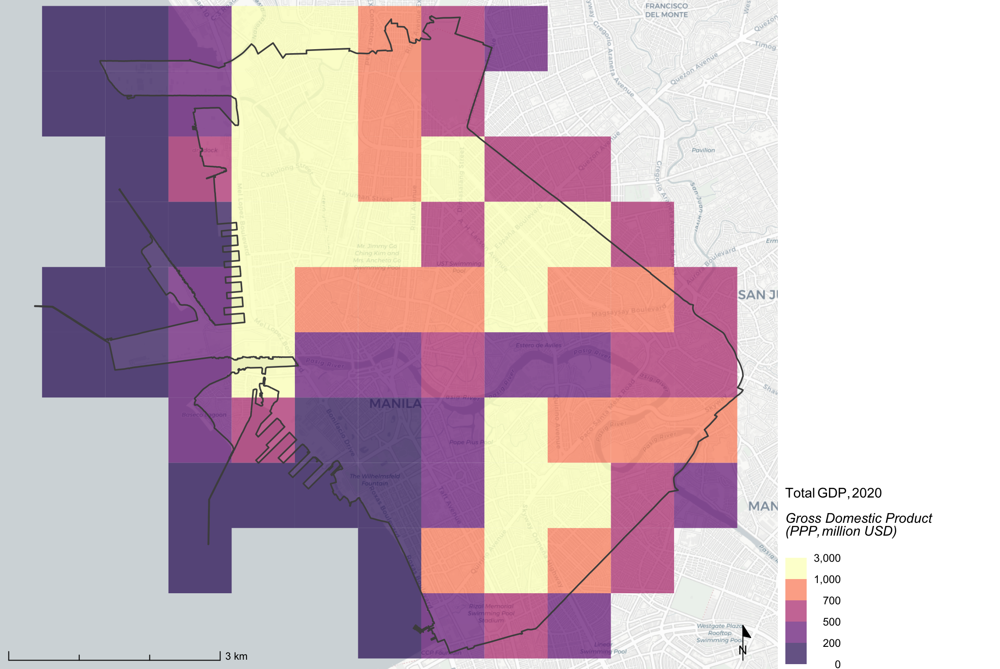{#fig-gdp-total .lightbox}

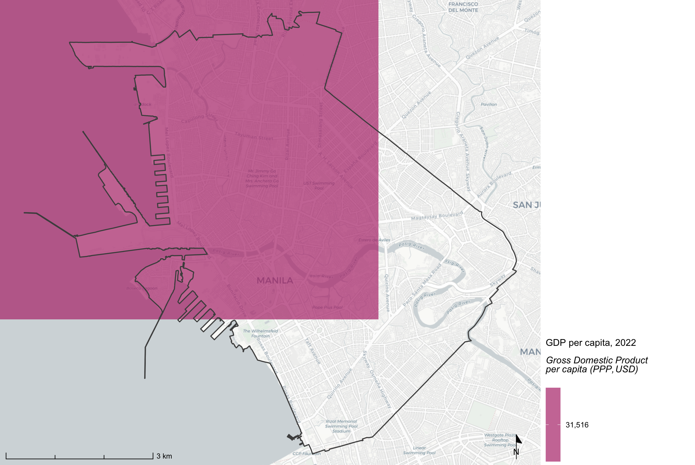{#fig-gdp-pc .lightbox}
:::


| Dataset | Measurement | Units | Source | Release Year | Years of Data | Coverage | Resolution | Task |
|---------|---------|---------|---------|---------|---------|---------|---------|------|
| Gridded Global GDP — Total GDP (PPP) | Admin-2 level GDP downscaled to 30 arc-sec grid using population and built-up area | Total GDP | Million USD (PPP-adjusted, 2017 USD) | 2025 | 1990–2020 (every 5 years) | Global | 30 arc-sec (~1km) | [tasks/gdp_gridded/](../tasks/gdp_gridded/) |
| Gridded Global GDP — Per Capita (PPP) | Admin-2 level GDP per capita downscaled from admin-1 using machine learning | GDP per capita | USD (PPP-adjusted, 2017 USD) | 2025 | 1990–2022 | Global (municipal level) | 5 arc-min (~10km) | [tasks/gdp_gridded/](../tasks/gdp_gridded/) |


**What is it?**

Two complementary gridded GDP datasets clipped to the city AOI: Total GDP at ~1km resolution (1990–2020, 5-year intervals) and GDP per capita at ~10km resolution (1990–2022). Both are PPP-adjusted in 2017 international dollars, enabling cross-country comparisons. The maps display the most recent available year: 2020 for total GDP and 2022 for per capita.

**Why use it?**

Gridded GDP enables spatial analysis of economic output within and around the city. Unlike aggregate national or regional statistics, the spatial resolution allows identification of economic concentration patterns, comparison of output across neighborhoods or districts, and overlay with hazard or population layers for risk-weighting. Having both total GDP and per capita values together supports analysis of economic density vs. efficiency.

**How is this made?**

The dataset employs machine learning algorithms trained on reported sub-national GDP data, achieving strong cross-validation performance (R²=0.79 for cross-validation, Pearson R=0.88 against reported data). Admin-2 level GDP per capita estimates are derived by downscaling from admin-1 level using ML, then multiplied by gridded population counts to produce total GDP at 30 arc-seconds. The per capita surface is retained at the native 5 arc-minute municipal-level resolution.

**How should we interpret it?**

High-value pixels indicate areas with concentrated economic activity or high income per capita. Pixels at 30 arc-seconds (~1km) blend multiple land uses, so values reflect sub-national area averages rather than building-level precision. In cities with strong urban-rural gradients, the urban core will typically appear as a distinct high-GDP cluster. GDP per capita at 10km resolution is most useful for regional comparisons rather than intra-city analysis.

**Under the hood**

[`tasks/gdp_gridded/collection.R`](../tasks/gdp_gridded/collection.R) reads two global GeoTIFF rasters from GCS using GDAL's `/vsicurl/` virtual file system and clips them to the AOI using the `terra` package. Total GDP values are converted from USD to million USD on export (`gdp_tot / 1e6`). Both outputs are multi-band rasters: one band per time step. Maps are rendered in R via [`core/R/`](../core/R/) using the `gdp_total` and `gdp_per_capita` layer definitions in [`source/layers.yml`](../source/layers.yml), displaying the most recent band.

**Key outputs**

- `mnt/{scan-id}/02-process-output/spatial/{city}_gdp_total.tif` — multi-band total GDP raster (1990–2020, 30 arc-sec)
- `mnt/{scan-id}/02-process-output/spatial/{city}_gdp_per_capita.tif` — multi-band GDP per capita raster (1990–2022, 5 arc-min)
- `mnt/{scan-id}/03-render-output/maps/gdp_total.png` — total GDP choropleth (2020)
- `mnt/{scan-id}/03-render-output/maps/gdp_per_capita.png` — GDP per capita choropleth (2022)

**Source data citation**

[@kummu_downscaled_2025]


--------

## GDP Sectoral

::: {layout-ncol=2}
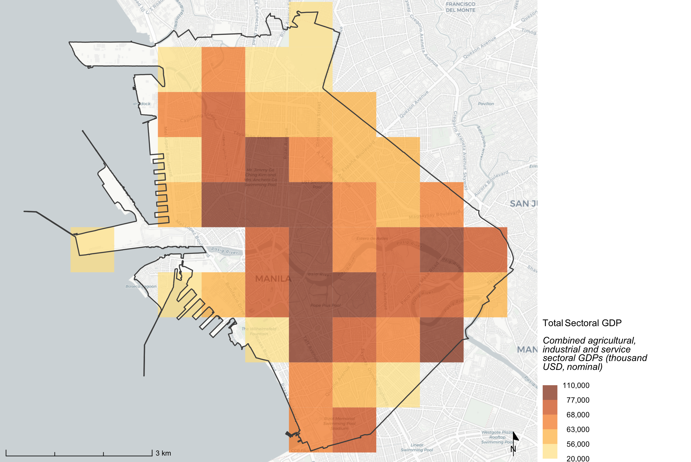{#fig-gdp-comb .lightbox}

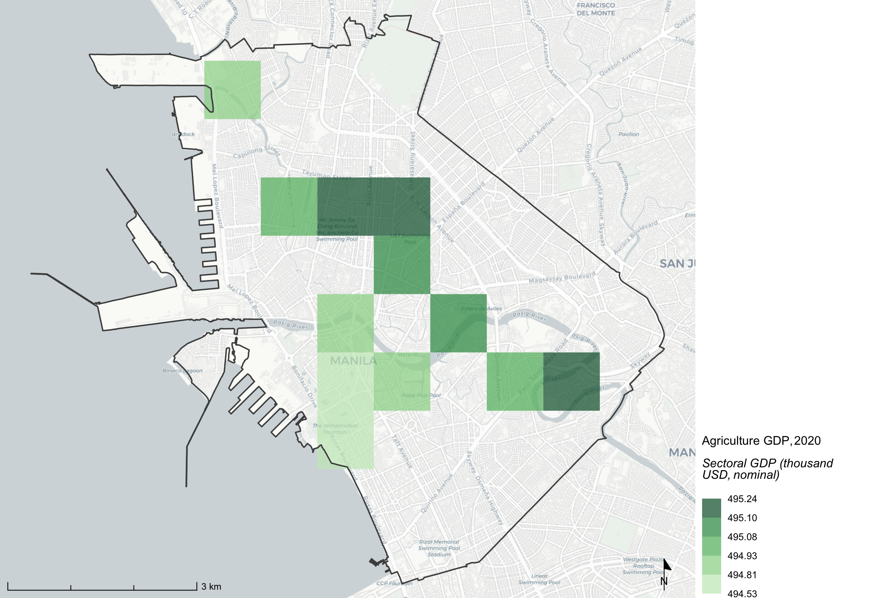{#fig-gdp-agri .lightbox}

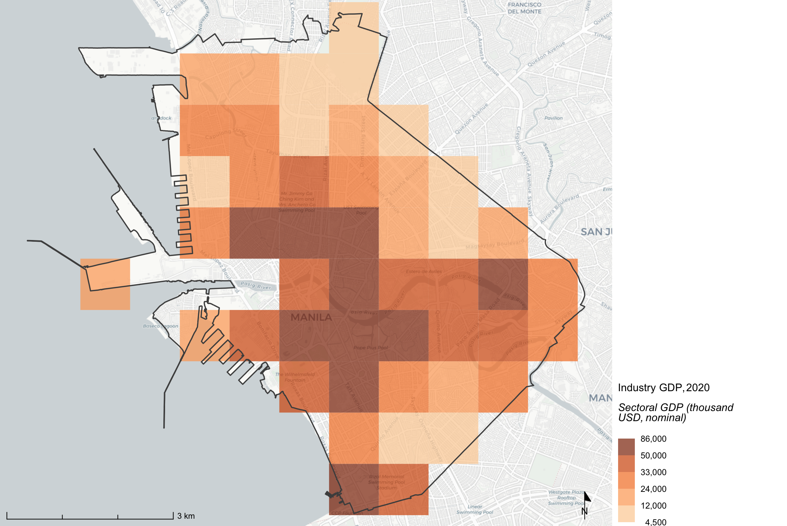{#fig-gdp-ind .lightbox}

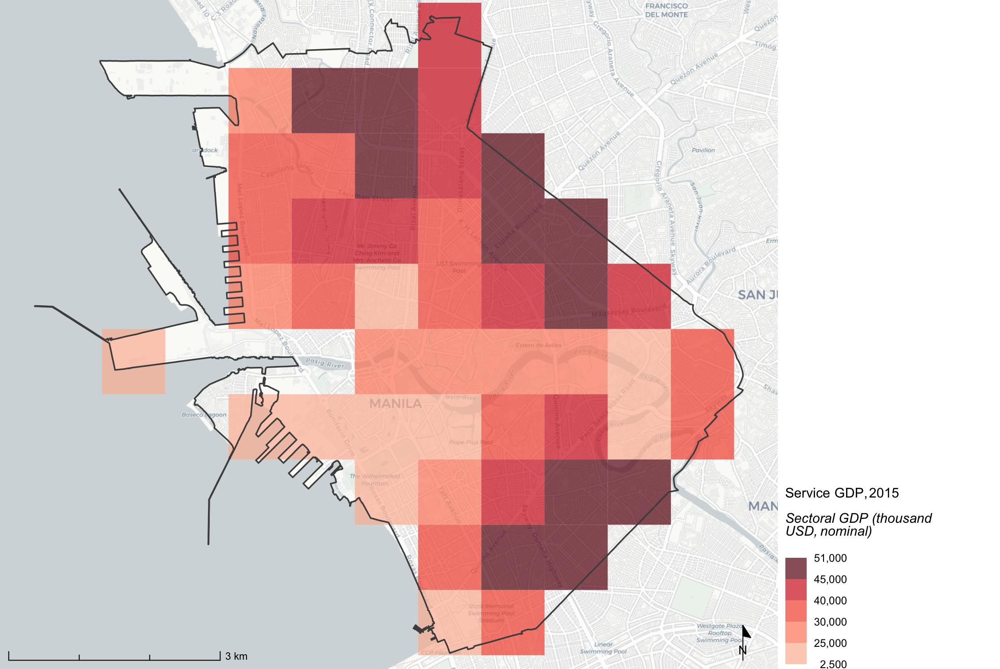{#fig-gdp-service .lightbox}
:::


| Dataset | Measurement | Units | Source | Release Year | Years of Data | Coverage | Resolution | Task |
|---------|---------|---------|---------|---------|---------|---------|---------|------|
| SectGDP30 — Agriculture | Downscaled agricultural GDP using land-use and population data | Agricultural GDP | Thousand USD (nominal) | 2025 | 2010, 2015, 2020 | Global | 30 arc-sec (~1km) | [tasks/gdp_sectoral/](../tasks/gdp_sectoral/) |
| SectGDP30 — Industry | Downscaled industrial GDP using land-use data | Industrial GDP | Thousand USD (nominal) | 2025 | 2010, 2015, 2020 | Global | 30 arc-sec (~1km) | [tasks/gdp_sectoral/](../tasks/gdp_sectoral/) |
| SectGDP30 — Services | Downscaled services GDP using land-use and population data | Services GDP | Thousand USD (nominal) | 2025 | 2010, 2015, 2020 | Global | 30 arc-sec (~1km) | [tasks/gdp_sectoral/](../tasks/gdp_sectoral/) |
| SectGDP30 — Combined | Sum of agriculture, industry, and services | Total sectoral GDP | Thousand USD (nominal) | 2025 | 2010, 2015, 2020 | Global | 30 arc-sec (~1km) | [tasks/gdp_sectoral/](../tasks/gdp_sectoral/) |


**What is it?**

Spatially distributed GDP maps broken down by economic sector — agriculture, industry, and services — at ~1km resolution for three reference years (2010, 2015, 2020). Each sector raster is produced by disaggregating sub-national GDP statistics using high-resolution land-use data from satellite imagery. A combined raster summing all three sectors is also generated.

**Why use it?**

Sectoral GDP maps reveal where different types of economic activity are concentrated within the city and its surroundings. Industrial areas, agricultural peripheries, and service-sector cores each have different profiles of flood exposure, employment density, and resilience. This spatial breakdown supports sector-specific risk assessment and business interruption estimation when overlaid with hazard data.

**How is this made?**

The SectGDP30 approach begins with country-level GDP decomposed into three sectors. Each sector is downscaled to a 30 arc-second grid in two steps: first via a population-based (PB) method that allocates GDP proportionally to population density, then reallocated to corresponding land-use fractions derived from satellite products (LUB method). The result shows strong consistency with sub-national statistics (R² > 0.9) and outperforms conventional population-only methods.

**How should we interpret it?**

High agricultural GDP pixels correspond to productive farmland near the city; high industrial GDP pixels indicate manufacturing zones or industrial estates; high service-sector GDP pixels align with commercial cores and dense urban areas. Comparing sector maps against population density or flood hazard layers reveals where critical economic activity is most exposed. Note that the service GDP map shows year 2015, as 2020 service data has coverage gaps in some regions.

**Under the hood**

[`tasks/gdp_sectoral/collection.py`](../tasks/gdp_sectoral/collection.py) reads three global SectGDP30 rasters from GCS (one per sector per year) using `rasterio`. Each is clipped to the AOI, converted from million USD to thousand USD (× 1000), and written as a 3-band GeoTIFF with band descriptions `gdp_{sector}_{year}`. A combined raster summing all three sectors per year is then assembled; if a sector band is all-zero (data gap), the most recent non-empty year for that sector is substituted. Sector maps are rendered in R via [`core/R/`](../core/R/) using definitions in [`source/layers.yml`](../source/layers.yml).

**Key outputs**

- `mnt/{scan-id}/02-process-output/spatial/{city}_gdp_agriculture.tif` — 3-band agricultural GDP (2010, 2015, 2020)
- `mnt/{scan-id}/02-process-output/spatial/{city}_gdp_industry.tif` — 3-band industrial GDP (2010, 2015, 2020)
- `mnt/{scan-id}/02-process-output/spatial/{city}_gdp_service.tif` — 3-band services GDP (2010, 2015, 2020)
- `mnt/{scan-id}/02-process-output/spatial/{city}_gdp_combined.tif` — 3-band combined GDP (2010, 2015, 2020)
- `mnt/{scan-id}/03-render-output/maps/gdp_agriculture.png` — agricultural GDP choropleth (2020)
- `mnt/{scan-id}/03-render-output/maps/gdp_industry.png` — industrial GDP choropleth (2020)
- `mnt/{scan-id}/03-render-output/maps/gdp_service.png` — services GDP choropleth (2015)
- `mnt/{scan-id}/03-render-output/maps/gdp_combined.png` — combined sectoral GDP choropleth (2020)

::: {.callout-note appearance="simple"}
**Cross-reference:** Sectoral GDP rasters are used to estimate potential business interruption losses under flood scenarios. See the Fathom × GDP Sectoral analysis in [multi-analysis.qmd](multi-analysis.qmd).
:::

**Source data citation**

[@shoji_global_2025]


--------

## GDP Total and Per Capita Growth (Oxford)

::: {layout-ncol=2}
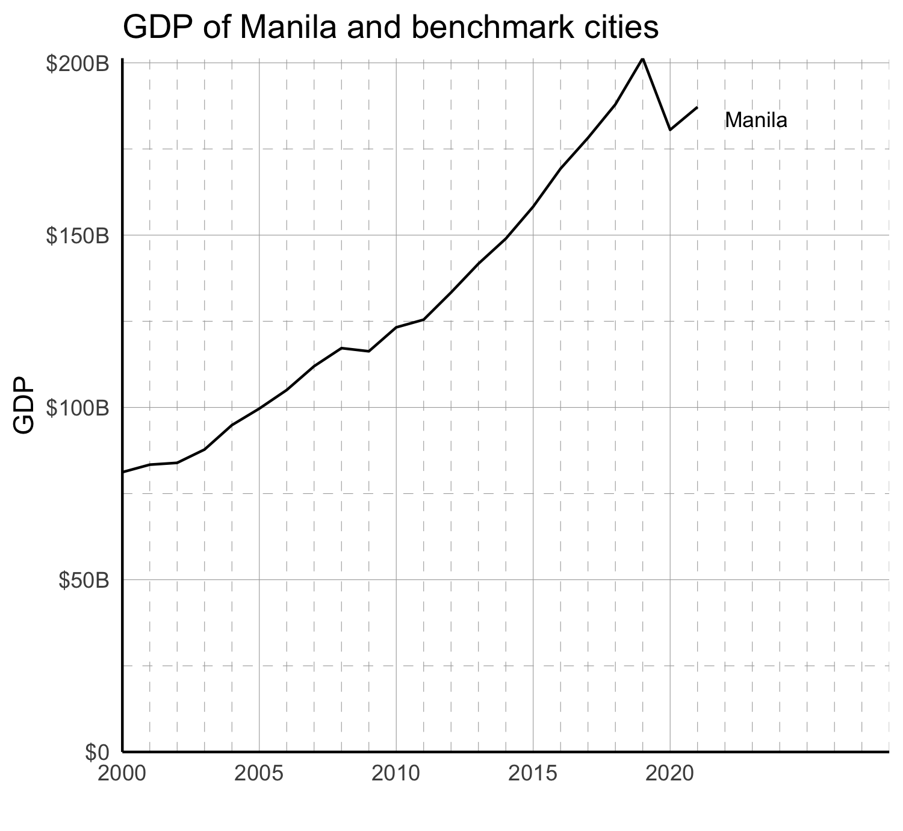{#fig-gdp-line .lightbox}

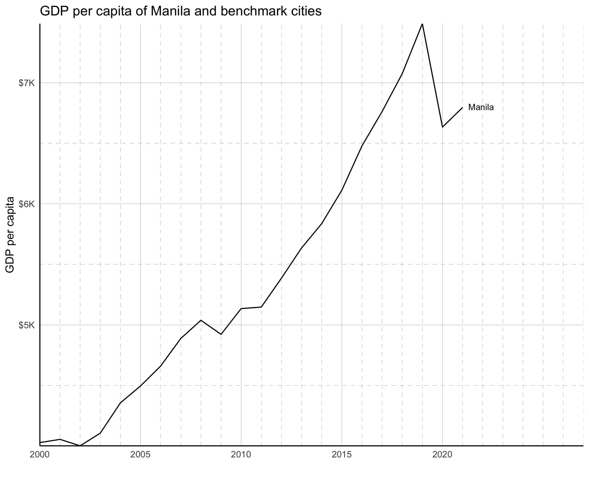{#fig-gdp-pc-line .lightbox}
:::


| Dataset | Measurement | Units | Source | Release Year | Years of Data | Coverage | Resolution | Tasks |
|---------|---------|---------|---------|---------|---------|---------|---------|---|
| Global Cities Database | GDP | GDP, real, US$ | Oxford Economics | 2022 | 2000–2040 | Global (per functional urban area) | City-level | [tasks/oxford/](../tasks/oxford/) |
| Global Cities Database | GDP per capita | GDP per capita, real, US$ | Oxford Economics | 2022 | 2000–2040 | Global (per functional urban area) | City-level | [tasks/oxford/](../tasks/oxford/) |


**What is it?**

Annual city-level time series of total GDP and GDP per capita from the Oxford Economics Global Cities Database, covering 2000–2040 (historical through ~2021, projections thereafter). GDP is reported in real US dollars at the functional urban area level. A companion chart places the city's GDP per capita alongside benchmark cities for regional comparison.

**Why use it?**

City-level GDP and GDP per capita time series provide economic context that gridded rasters cannot: long historical trends, forward projections to 2040, and direct comparisons against benchmark cities at comparable points in their development. These indicators support assessment of whether the city's economy is growing, at what pace, and how it compares to peers — a critical backdrop for infrastructure investment planning and resilience assessments.

**How is this made?**

Oxford Economics harmonizes data from national statistics offices, censuses, and administrative sources to consistent city boundary definitions. GDP is the aggregate measure of production equal to the sum of gross values added of all resident institutional units. GDP per capita is derived by dividing total GDP by population, and year-over-year growth percentages are computed from the raw time series.

**How should we interpret it?**

A rising GDP line indicates an expanding economy; a flattening or declining line signals stagnation or contraction. GDP per capita growth that outpaces population growth indicates rising living standards. Benchmark comparisons help identify whether observed trends are city-specific or reflect broader regional patterns. Note that Oxford uses Functional Urban Area definitions, so totals may differ substantially from those derived from smaller administrative boundaries.

**Under the hood**

[`tasks/oxford/collection.R`](../tasks/oxford/collection.R) reads the Oxford Economics Global Cities CSV from GCS, filters for the target city and benchmark cities, and computes GDP growth time series. It saves `_oxford_gdp.csv` (annual total GDP, 2000–2021), `_oxford_gdp_growth.csv` (year-over-year growth %), `_oxford_gdppc.csv` (GDP per capita snapshot), and `_oxford_gdppc_timeseries.csv` (GDP per capita over time). Charts are rendered in R via [`tasks/oxford/charts/`](../tasks/oxford/charts/).

**Key outputs**

- `mnt/{scan-id}/02-process-output/tabular/{city}_oxford_gdp.csv` — annual total GDP, 2000–2021 (real USD)
- `mnt/{scan-id}/02-process-output/tabular/{city}_oxford_gdp_growth.csv` — year-over-year GDP growth %
- `mnt/{scan-id}/02-process-output/tabular/{city}_oxford_gdppc.csv` — GDP per capita snapshot (2021) vs. benchmark cities
- `mnt/{scan-id}/02-process-output/tabular/{city}_oxford_gdppc_timeseries.csv` — GDP per capita time series
- `mnt/{scan-id}/03-render-output/plots/oxford-gdp-line.png` — total GDP time series chart
- `mnt/{scan-id}/03-render-output/plots/oxford-gdp-per-capita.png` — GDP per capita comparison (2021)
- `mnt/{scan-id}/03-render-output/plots/oxford-gdp-per-capita-line.png` — GDP per capita time series chart


**Source data citation**

[@oxford2022global]


--------

## Gross Value Added (Oxford)

::: {layout-ncol=1}
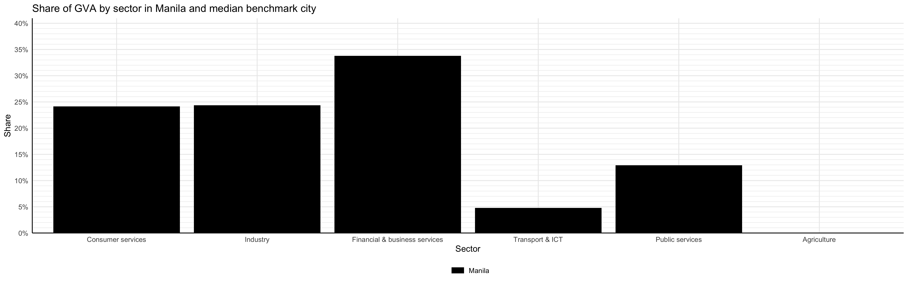{#fig-gva .lightbox}

:::


| Dataset | Measurement | Units | Source | Release Year | Years of Data | Coverage | Resolution | Tasks |
|---------|---------|---------|---------|---------|---------|---------|---------|---|
| Global Cities Database | Gross Value Added by sector | GVA shares by sector, % | Oxford Economics | 2022 | 2000–2040 | Global (per functional urban area) | City-level | [tasks/oxford/](../tasks/oxford/) |


**What is it?**

A breakdown of the city's economic output by sector — consumer services, industry, financial and business services, transport and ICT, public services, and agriculture — expressed as shares of total gross value added (GVA) in 2021. GVA is the value of output less the value of intermediate consumption; it represents each sector's contribution to total economic output. A companion chart shows the median sectoral shares for benchmark cities, enabling structural comparisons.

**Why use it?**

The sectoral composition of an economy determines its resilience profile and development trajectory. A city dominated by financial services has different vulnerabilities than one reliant on industry or agriculture. GVA shares reveal economic structure at a glance and support targeted resilience planning — for example, identifying which sectors drive employment and which are most exposed to specific hazards.

**How is this made?**

Oxford Economics estimates GVA by sector using a combination of reported city-level data (where available), downscaling from national or regional figures using population and employment location quotients, and productivity-adjusted employment data. City-center areas are weighted toward financial and business services; peripheries are weighted toward consumer services and industry. In developing countries without sub-national data, historical GVA growth in specific industries is additionally calibrated to population growth and inter-industry demand.

**How should we interpret it?**

A large consumer services share reflects a city that serves its own population (retail, food, hospitality). A large financial and business services share indicates a regional hub with high productivity. A sizable industry share may reflect manufacturing zones or resource processing. Comparing the city's profile to the benchmark median helps identify structural similarities or outlier characteristics.

**Under the hood**

[`tasks/oxford/collection.R`](../tasks/oxford/collection.R) filters Oxford GVA indicators, computes sector shares as a percentage of total GVA, and saves `_oxford_gva_sectors.csv` (median shares for city and benchmark group) and `_oxford_gva_sectors_individual.csv` (individual city values). The sector bar chart is rendered in R via [`tasks/oxford/charts/`](../tasks/oxford/charts/).

**Key outputs**

- `mnt/{scan-id}/02-process-output/tabular/{city}_oxford_gva_sectors.csv` — GVA share by sector (city vs. benchmark median, 2021)
- `mnt/{scan-id}/02-process-output/tabular/{city}_oxford_gva_sectors_individual.csv` — GVA share by sector for each individual city
- `mnt/{scan-id}/03-render-output/plots/oxford-gva-sectors.png` — sectoral GVA share chart


**Source data citation**

[@oxford2022global]


--------

## Employment (Oxford)

::: {layout-ncol=2}
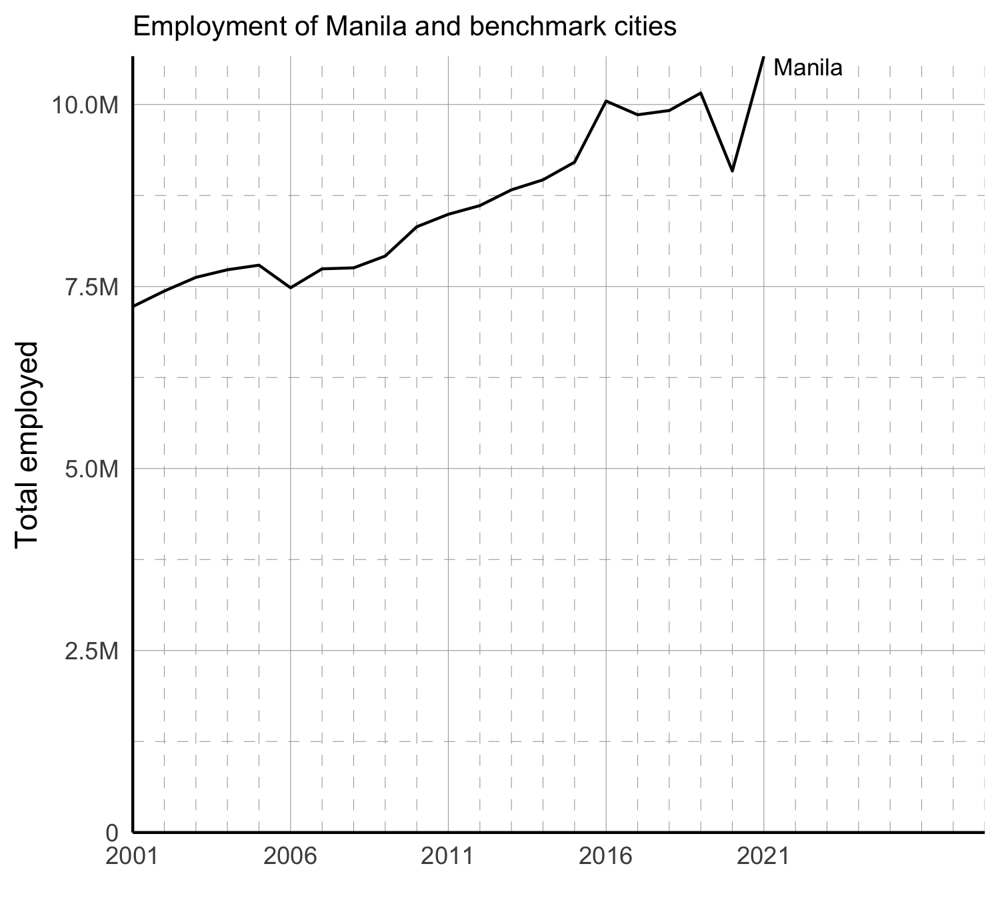{#fig-emp-line .lightbox}

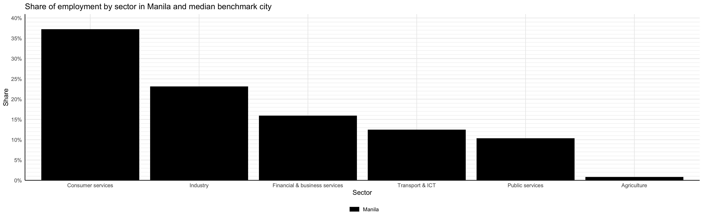{#fig-emp-sect .lightbox}
:::


| Dataset | Measurement | Units | Source | Release Year | Years of Data | Coverage | Resolution | Tasks |
|---------|---------|---------|---------|---------|---------|---------|---------|---|
| Global Cities Database | Persons employed by the geographical location of their work (workplace-based employment) | People | Oxford Economics | 2022 | 2000–2040 | Global (per functional urban area) | City-level | [tasks/oxford/](../tasks/oxford/) |


**What is it?**

Annual total employment for the city from 2000 to 2021 and a sectoral breakdown of employment shares in 2021. Employment is defined as workplace-based (by the location of the job, not the worker's residence) and covers all sectors: consumer services, industry, financial and business services, transport and ICT, public services, and agriculture. A companion chart shows the city's sectoral employment profile against the median of benchmark cities.

**Why use it?**

Employment levels and sectoral composition are core indicators of economic health and social stability. Employment growth signals expanding economic opportunity; contraction signals vulnerability. Sectoral shares reveal which industries drive livelihoods, and comparing against benchmarks highlights whether the city's labor market is diversified or concentrated in sectors with higher climate or economic exposure.

**How is this made?**

Oxford Economics uses city-level employment statistics directly where available (covering Australia, Europe, Canada, the US, Mexico, and Brazil). For cities without sufficiently granular data, employment is estimated from broader regional or national figures using population location quotients (LQs) by industry — reflecting the relative importance of each sector in a city versus national economy. LQ patterns are estimated from countries with available city data and calibrated by level of economic development.

**How should we interpret it?**

Rapid employment growth alongside moderate population growth suggests rising labor force participation or in-migration of workers. A high share of consumer services typically reflects a service-oriented urban economy; a high industry share may indicate reliance on manufacturing that is sensitive to global supply chain disruptions. Compare with the GVA shares chart to assess whether labor-intensive sectors are also high-value.

**Under the hood**

[`tasks/oxford/collection.R`](../tasks/oxford/collection.R) processes employment indicators from the Oxford dataset, computing year-over-year growth percentages and sector shares. It saves `_oxford_emp.csv` (total employment time series), `_oxford_emp_growth.csv` (growth %), `_oxford_emp_sectors.csv` (median sector shares), and `_oxford_emp_sectors_individual.csv`. Charts are rendered in R via [`tasks/oxford/charts/`](../tasks/oxford/charts/).

**Key outputs**

- `mnt/{scan-id}/02-process-output/tabular/{city}_oxford_emp.csv` — total employment time series (2000–2021)
- `mnt/{scan-id}/02-process-output/tabular/{city}_oxford_emp_growth.csv` — employment year-over-year growth %
- `mnt/{scan-id}/02-process-output/tabular/{city}_oxford_emp_sectors.csv` — employment share by sector (city vs. benchmark median, 2021)
- `mnt/{scan-id}/02-process-output/tabular/{city}_oxford_emp_sectors_individual.csv` — employment share by sector for each individual city
- `mnt/{scan-id}/03-render-output/plots/oxford-emp-line.png` — total employment time series chart
- `mnt/{scan-id}/03-render-output/plots/oxford-employment-sectors.png` — sectoral employment share chart


**Source data citation**

[@oxford2022global]


--------

## Household Income (Oxford)

::: {layout-ncol=2}
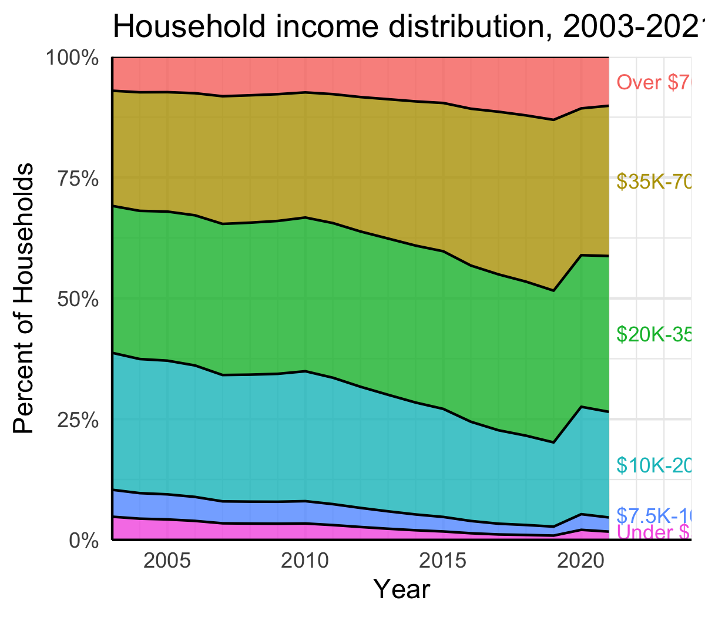{#fig-hhinc-area .lightbox}

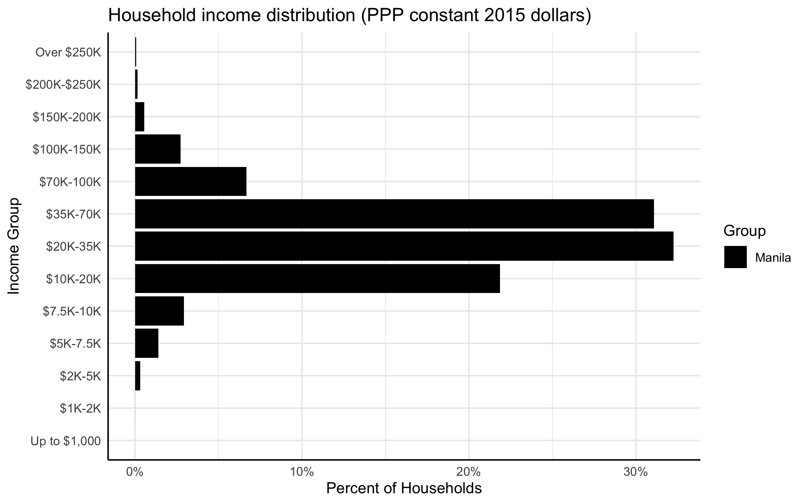{#fig-hhinc-bar .lightbox}
:::


| Dataset | Measurement | Units | Source | Release Year | Years of Data | Coverage | Resolution | Tasks |
|---------|---------|---------|---------|---------|---------|---------|---------|---|
| Global Cities Database | Percent of households by income band | Percent of total households | Oxford Economics | 2022 | 2000–2040 | Global (per functional urban area) | City-level | [tasks/oxford/](../tasks/oxford/) |


**What is it?**

The distribution of households across income bands (expressed in PPP constant 2015 USD), shown both as a snapshot for 2021 compared to benchmark cities and as a time series from 2002 to 2021 for the focus city. Income bands range from "Under $5K" to "Over $70K" per household. The area chart shows how the income distribution has shifted over time, revealing whether middle- and upper-income households have grown as a share of the total.

**Why use it?**

Household income distribution captures economic inequality at the city level and tracks changes in living standards over time. A growing share of middle-income households signals economic mobility and expanding consumer demand; a persistently large share of low-income households indicates structural poverty. Comparing the distribution against benchmark cities contextualizes whether observed patterns reflect the city's specific conditions or broader regional income levels.

**How is this made?**

Household disposable income — defined as income from all sources (wages, interest, property, benefits, dividends) less taxes and social security contributions — is estimated at the city level. Where consumption and income data are unavailable, Oxford Economics estimates the city's share of national disposable income using its share of national GDP and population growth, then derives private consumption through a savings equation that accounts for income-dependent savings rates.

**How should we interpret it?**

A shift in the area chart from lower to higher income bands over time indicates rising household prosperity. A dominant "Under $5K" band suggests a large population living near or below the poverty threshold in purchasing-power terms. When comparing with benchmark cities, note that PPP-adjusted figures remove the effect of local price differences, making cross-city comparisons more meaningful. These estimates reflect city-level averages; within-city inequality (e.g., wealthy enclaves vs. informal settlements) is not captured here — see the Relative Wealth section in the Population chapter for spatial inequality patterns.

**Under the hood**

[`tasks/oxford/collection.R`](../tasks/oxford/collection.R) processes household income band indicators from the Oxford dataset, simplifying the raw income bands into broader groups (Under $5K, $7.5K–10K, $10K–20K, $20K–35K, $35K–70K, Over $70K) for clarity. It saves `_oxford_incomes.csv` (simplified distribution for the focus city, 2002–2021) and `_oxford_incomes_all.csv` (full band detail for all cities). Charts are rendered in R via [`tasks/oxford/charts/`](../tasks/oxford/charts/).

**Key outputs**

- `mnt/{scan-id}/02-process-output/tabular/{city}_oxford_incomes.csv` — household income distribution over time (simplified bands, 2002–2021)
- `mnt/{scan-id}/02-process-output/tabular/{city}_oxford_incomes_all.csv` — household income distribution (all income bands, all cities)
- `mnt/{scan-id}/03-render-output/plots/oxford-household-incomes-area.png` — income distribution over time area chart
- `mnt/{scan-id}/03-render-output/plots/oxford-household-incomes-bar.png` — income distribution comparison bar chart (2021)


**Source data citation**

[@oxford2022global]
