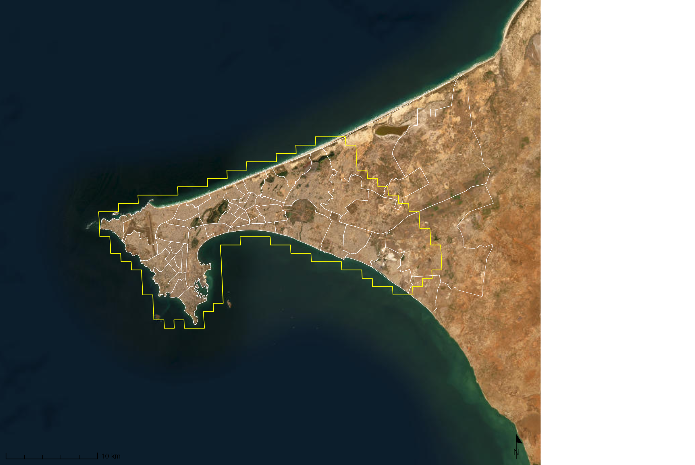
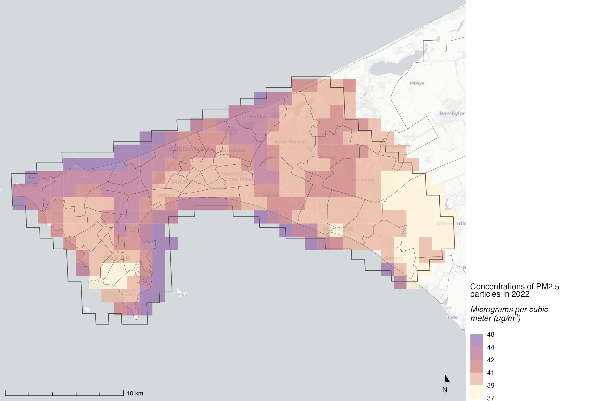
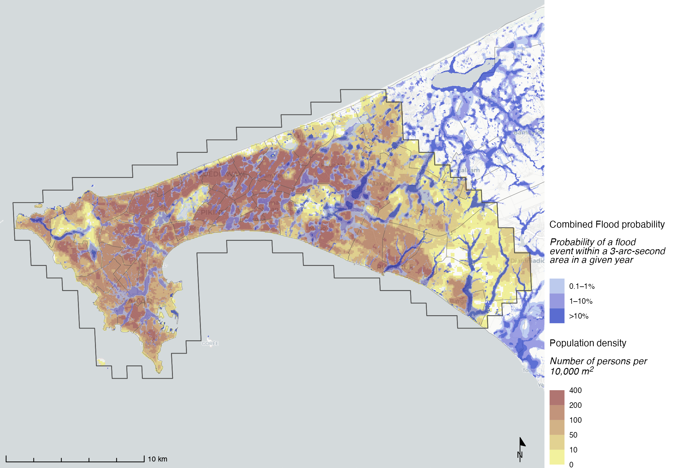
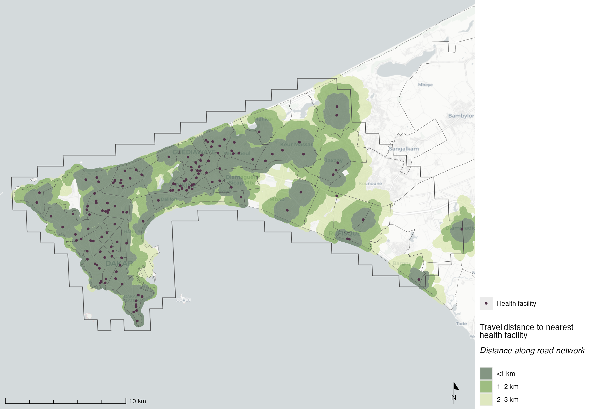
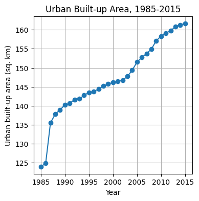
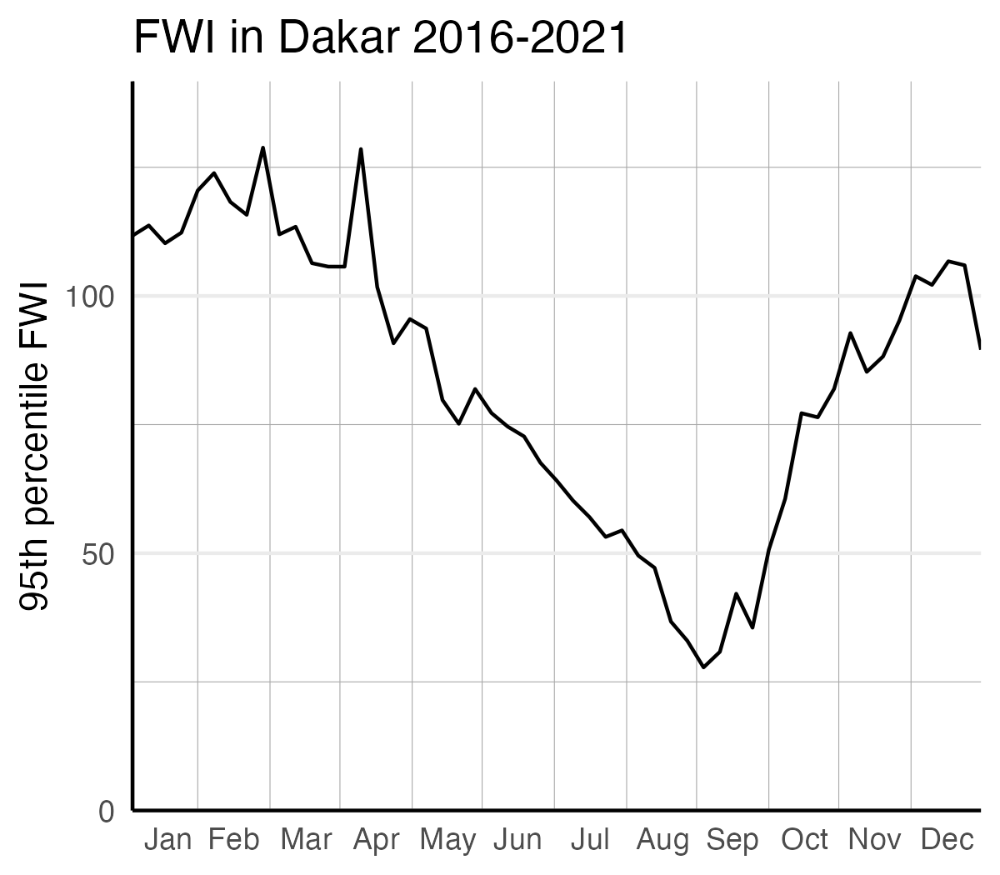
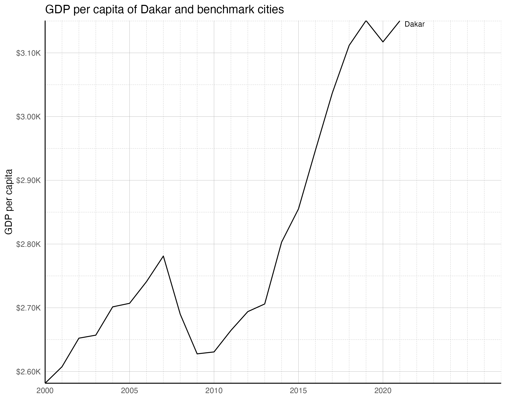
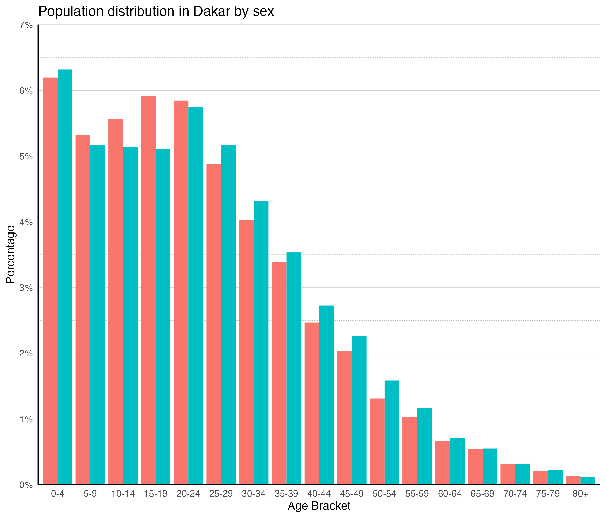

# City Scan Examples

City Scan output is a collection of maps and charts made from global and publicly available datasets that provide quick high-level insights into resilience-related topics for a city. The output is a package of maps, data visualizations and insights that integrate features of both the built and natural environments. It is available as standalone images, compiled PDF, and interactive Quarto HTML. 

## Example 1: Standalone Analysis - example: Dakar, Senegal

This format is useful if you'd like to combine City Scan outputs with your own analysis. See examples from our analysis for Dakar, Senegal

::: {#fig-maps layout-nrow=2}
{#fig-aoi .lightbox}

{#fig-airquality .lightbox}

{#fig-floodpopulation .lightbox}

{#fig-healthcare .lightbox}

{#fig-builtup .lightbox}

{#fig-fwi .lightbox}

{#fig-gdppp .lightbox}

{#fig-age .lightbox}

Examples of maps & charts generated by City Scan
:::

## Example 2: Comprehensive Analytical PDF Report - Bitung, Indonesia
The generated maps and charts are compiled according to relevant themes, along with data interpretation and considerations. See examples below from our analysis in Bitung, Indonesia.

<iframe src="https://drive.google.com/file/d/1FOiUzZbEoM1a4WXs-JLG18iQoEDzdalW/preview?usp=sharing" 
        width="100%" height="600px" allow="autoplay"></iframe>

::: {.callout-note}
The final PDF output is compiled and designed via Adobe InDesign and not yet automatically generated by the code. Automated PDF generation will be part of future updates. 
:::

## Example 3: Interactive HTML website - City, Country

*This section is in progress and will be updated.*

::: {.callout-tip}
Full case studies for Rabat and the Philippines are in [Part 6. Case Studies & Galleries](case-standard-rabat.qmd).
:::
