# Population and Demographics

## Overview

This section presents key population and demographic information for the city, including growth trends, age-sex distribution, and density. City Scan draws on several publicly available sources, summarised below.

---

**Data Sources**

| Dataset | Summary | Measurement | Units | Coverage |
|----|---------|---|---|---|
| Oxford Economic's Global Cities Database | data is extracted from national sources by aggregating local administrative unit data or, when unavailable, by applying wider regional age distributions to the city's total population. |Population count | People per Functional Urban Areas (per city) | 2000–2040 |
| WorldPop Global 1 | Multi-annual global gridded population estimates at 1km resolution, disaggregated by age and sex using census data and the Built-Settlement Growth Model (BSGM). | Population count | People per 1km grid cell within specified AOI | 2000–2020 |
| WorldPop Global 2 (R2025A) | Improved successor to Global 1, using an AI-driven multi-year model for more accurate building and residential area mapping, at 100m resolution. | Population count | People per 100m grid cell within specified AOI | 2015–2030 |
| GHS-POP R2023A | Residential population estimates derived from CIESIN GPWv4.11 were disaggregated from census or administrative units to grid cells, informed by the distribution, volume, and classification of built-up as mapped in the Global Human Settlement Layer (GHSL) global layer per corresponding epoch.| Population count | People per 100m grid cell within specified AOI| 1975–2030 (5-year epochs) |

--------

**Relevant Tasks**

```
tasks/
├── oxford/          — city-level population, economics, and age structure (Oxford Economics)
├── worldpop/        — gridded population rasters and growth time series (WorldPop)
├── demographics/    — age-sex structure rasters and dependency ratios (WorldPop R2025A)
├── ghs_population/  — long-run historical population rasters (GHS-POP R2023A)
└── rwi/             — relative wealth index polygons (Meta Data for Good)
```

--------

**Relevant Outputs**

```
mnt/{scan-id}/
├── 02-process-output/
│   ├── spatial/
│   │   ├── {city}_population.tif                   — current-year population (100m, G2)
│   │   ├── {city}_worldpop_2000_2020.tif           — 21-band annual archive (1km, G1)
│   │   ├── {city}_worldpop_2015_2030.tif           — 16-band annual archive (100m, G2)
│   │   ├── {city}_worldpop_demographics.tif        — 36-band age-sex raster
│   │   ├── {city}_ghs_pop_E{year}.tif              — per-epoch GHS-POP raster
│   │   └── {city}_rwi.gpkg                         — RWI polygons with wealth categories
│   └── tabular/
│       ├── {city}_population_stats.csv             — WorldPop current-year summary stats
│       ├── {city}_worldpop_2015_2030.csv           — annual G2 population totals
│       ├── {city}_worldpop_2000_2020.csv           — annual G1 population totals
│       ├── {city}_pg.csv                           — WorldPop population + growth %
│       ├── {city}_pug.csv                          — population–urban growth ratio
│       ├── {city}_oxford_pop_growth.csv            — Oxford annual population + growth %
│       ├── {city}_oxford_national_shares.csv       — city share of national pop/GDP/employment
│       ├── {city}_oxford_age_structure.csv         — Oxford historical age-group shares
│       ├── {city}_oxford_pop_dist.csv              — Oxford age distribution vs. benchmarks
│       ├── {city}_demographic.csv                  — per-band age-sex counts
│       ├── {city}_pas.csv                          — aggregated age pyramid
│       ├── {city}_adr.csv                          — dependency ratios
│       ├── {city}_rwi_area.csv                     — RWI area by city-relative bin
│       ├── {city}_rwi_area_standardized.csv        — RWI area by standardized bin
│       └── {city}_ghs_pop_e{year}.csv             — GHS-POP summary stats per epoch
└── 03-render-output/
    ├── maps/
    │   ├── population.png                          — WorldPop current-year density map
    │   ├── rwi_standardized.png                    — RWI standardized choropleth
    │   └── rwi_relative.png                        — RWI city-relative choropleth
    └── plots/
        ├── oxford-pop-growth.png                   — Oxford population time series
        ├── oxford-pop-line.png                     — Oxford population vs. benchmarks
        ├── oxford-pop-distro.png                   — Oxford age distribution vs. benchmarks
        ├── oxford-age-structure-area.png           — Oxford age-group shares over time
        ├── worldpop-g1-growth.png                  — WorldPop G1 population growth
        ├── worldpop-g2-growth.png                  — WorldPop G2 population growth
        ├── worldpop-pop-density-distribution.png   — Population density distribution
        └── world-pop-age-sex.png                   — Age-sex pyramid
```

--------

## Population Growth (Oxford Economics)

<!-- chart examples -->
::: {layout-ncol=2}
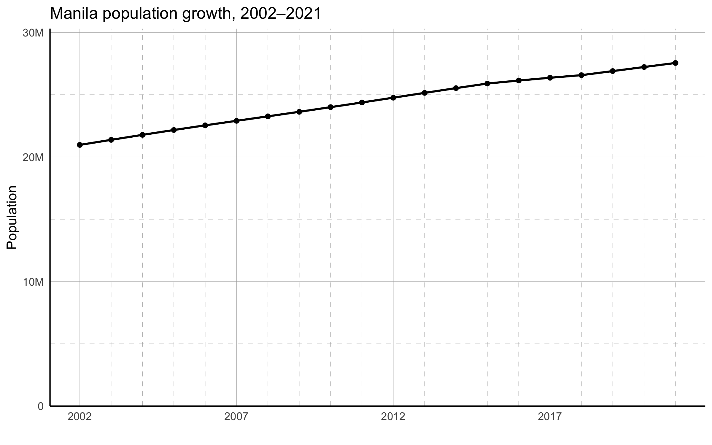{#fig-pop-growth .lightbox height=300}

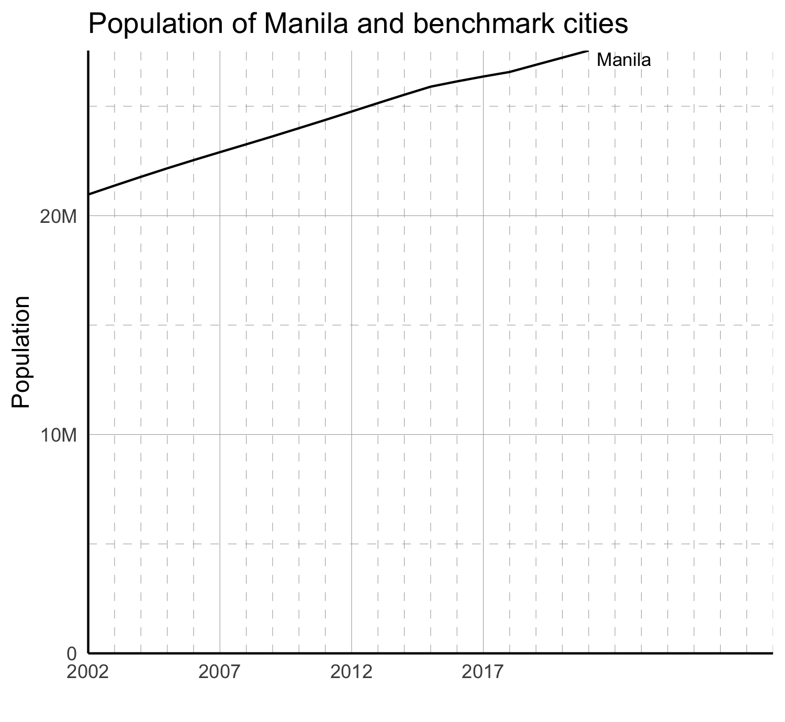{#fig-pop-line .lightbox height=300}

:::

<!-- warning -->
::: {.callout-warning title="Internal Note: benchmark cities not appearing"}
Known issues with benchmark cities: oxford tasks not producing benchmark cities and processing is slow.
:::

<!-- data source table -->
| Dataset | Measurement | Units | Source | Release Year | Years of Data | Coverage | Resolution | Task |
|---------|-------------|-------|--------|--------------|---------------|----------|------------|------|
| Global Cities Database | Population count | People | Oxford Economics | 2022 | 2000–2040 | Global (per functional urban area) | City-level | [tasks/oxford/](../tasks/oxford/) |


**What is it?**

An annual city-level population time series from the Oxford Economics Global Cities Database, covering 2000–2040 (historical actuals through ~2021, projections thereafter). A companion chart shows the same series for a set of user-specified benchmark cities, enabling regional comparisons.


**Why use it?**

Population figures are typically used as a denominator for many indicators and as a measure of demand for services. High growth of urban populations — driven by natural increase, rural-to-urban migration, and the absorption of surrounding settlements — puts pressure on cities to meet demand for housing, infrastructure, and public services. Tracking growth relative to benchmark cities provides context for whether the city's trajectory is typical for its region or income level.

**How is this made?**

Oxford Economics harmonizes data from national statistics offices, censuses, and administrative sources to consistent city boundary definitions. Year-over-year population growth percentages are computed from the raw time series.

**How should we interpret it?**

A consistently rising line indicates ongoing demographic pressure. Slowing growth rates can reflect urban maturation, suburbanization, or aging. Benchmark comparisons help identify whether observed trends are local or regional patterns.

**Under the hood**

The [`tasks/oxford/`](../tasks/oxford/) task reads the Oxford Economics Global Cities Data CSV from a GCS bucket, filters for the target city and a set of benchmark cities, and produces tabular outputs covering population, employment, GDP, and demographic structure. The collection step runs entirely in R via [`tasks/oxford/collection.R`](../tasks/oxford/collection.R). For population specifically, the pipeline produces `_oxford_pop_growth.csv` (population + year-over-year growth %) and `_oxford_national_shares.csv` (city's share of national population, GDP, and employment in 2021).

**Key outputs**

- `mnt/{scan-id}/02-process-output/tabular/{city}_oxford_pop_growth.csv` — annual population and year-over-year growth % (2000–2040)
- `mnt/{scan-id}/02-process-output/tabular/{city}_oxford_national_shares.csv` — city share of national population, GDP, and employment (2021)
- `mnt/{scan-id}/02-process-output/tabular/{city}_oxford_age_structure.csv` — historical age-group shares (2000–2021)
- `mnt/{scan-id}/02-process-output/tabular/{city}_oxford_pop_dist.csv` — age distribution snapshot vs. benchmark cities
- `mnt/{scan-id}/03-render-output/plots/oxford-pop-growth.png` — population time series for target city
- `mnt/{scan-id}/03-render-output/plots/oxford-pop-line.png` — population time series for city and benchmarks

**Source data citation**

[@oxford2022global]

--------

## Population Growth (WorldPop)

<!-- chart examples -->
::: {layout-ncol=2}

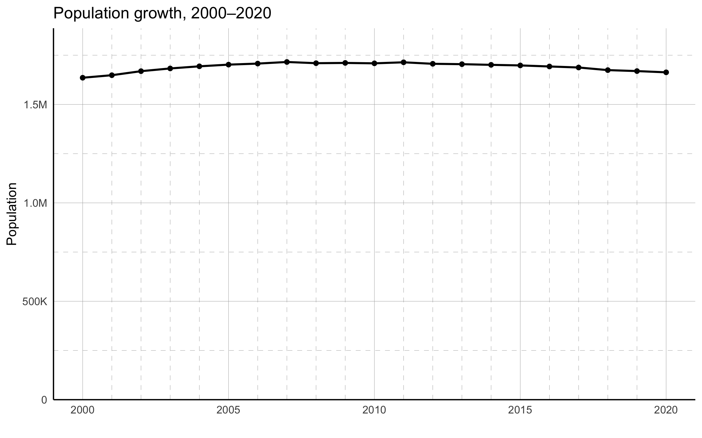{#fig-pop-line .lightbox height=300}

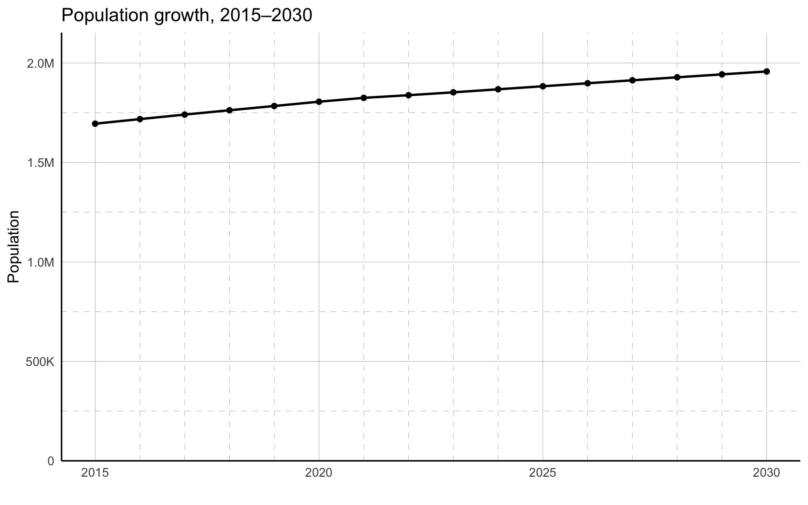{#fig-pop-line .lightbox height=300}
:::


<!-- data source table -->
| Dataset | Measurement | Units | Source | Release Year | Years of Data | Coverage | Resolution | Task |
|---------|-------------|-------|--------|--------------|---------------|----------|------------|------|
| WorldPop Global 2 (R2025A) | Population count | People per 100m grid cell | [WorldPop](https://www.worldpop.org/) | 2025 | 2015–2030 | Global (clipped to AOI) | 100m | [tasks/worldpop/](../tasks/worldpop/) |
| WorldPop Global 1 | Population count | People per 1km grid cell | [WorldPop](https://www.worldpop.org/) | 2020 | 2000–2020 | Global (clipped to AOI)| 1km | [tasks/worldpop/](../tasks/worldpop/) |


**What is it?**

Annual population totals within the city's AOI, derived from gridded WorldPop rasters. Two time series are shown: Global 1 (G1) covers 2000–2020 at 1km resolution; Global 2 (G2, R2025A) covers 2015–2030 at 100m resolution. Year-over-year growth percentages are computed from both archives.

**Why use it?**

Gridded population growth provides a spatially grounded complement to city-level estimates. Because WorldPop strictly clips to the provided AOI, these figures reflect population change within the administrative boundary rather than the broader functional urban area. The two archives overlap (2015–2020), allowing cross-validation, while G1 extends the record back to 2000 and G2 provides higher-resolution coverage and forward projections to 2030.

**How is this made?**

WorldPop G1 (2000–2020) tiles are downloaded directly from the WorldPop data portal at 1km resolution and mosaicked for multi-country AOIs. WorldPop G2 (2015–2030) tiles are downloaded at 100m resolution using the R2025A constrained model. For each archive, single-year rasters are stacked into a multi-band GeoTIFF and clipped to the AOI. Annual population totals are summed across all pixels; year-over-year growth percentages are then computed to produce the growth series shown in these charts.

**How should we interpret it?**

A consistently rising line indicates ongoing demographic pressure. Slowing growth rates can reflect urban maturation, suburbanization, or aging. Because WorldPop adheres strictly to the provided AOI boundary, population totals reflect only the area within that boundary and may differ substantially from broader metropolitan or functional urban area estimates.

**Under the hood**

[`tasks/worldpop/`](../tasks/worldpop/) downloads rasters from WorldPop directly or from a GCS mirror, handling multi-country AOIs by downloading each country tile and mosaicking with `rasterio.merge`. The `_stack_mask()` function stacks single-year files into a multi-band archive with band descriptions `pop_{year}`. `clean_pg()` in [`tasks/worldpop/analysis.py`](../tasks/worldpop/analysis.py) reads the stacked archive's annual totals and computes year-over-year growth percentages. Growth charts are rendered in R via [`tasks/worldpop/charts/`](../tasks/worldpop/charts/).

**Key outputs**

- `mnt/{scan-id}/02-process-output/spatial/{city}_worldpop_2000_2020.tif` — 21-band annual archive (1km, G1)
- `mnt/{scan-id}/02-process-output/spatial/{city}_worldpop_2015_2030.tif` — 16-band annual archive (100m, G2)
- `mnt/{scan-id}/02-process-output/tabular/{city}_worldpop_2000_2020.csv` — annual G1 population totals per year
- `mnt/{scan-id}/02-process-output/tabular/{city}_worldpop_2015_2030.csv` — annual G2 population totals per year
- `mnt/{scan-id}/02-process-output/tabular/{city}_pg.csv` — annual population + year-over-year growth %
- `mnt/{scan-id}/03-render-output/plots/worldpop-g1-growth.png` — G1 population growth chart
- `mnt/{scan-id}/03-render-output/plots/worldpop-g2-growth.png` — G2 population growth chart

**Source data citation**

[@bondarenko2020worldpop; @worldpop2025g2]

::: {.callout-tip title="Why does Oxford show a much larger population than WorldPop?" collapse="true"}
In the Oxford charts, Manila's population exceeds 20 million, while the WorldPop charts show approximately 1.4 million. The difference is geographic scope, not data error. Oxford Economics uses Functional Urban Areas (FUAs) — for Manila, this corresponds to Metro Manila, which covers a large multi-city metropolitan region. The full FUA methodology is described [here](https://www.oecd.org/en/publications/cities-in-the-world_d0efcbda-en.html).

WorldPop analyses strictly clip to the provided AOI. When the AOI is the historic City of Manila (a single municipality), the population is approximately 1.4 million. The same WorldPop data for Metro Manila would produce a figure comparable to Oxford's.
:::


--------

## Population Density

::: {layout-ncol=2}
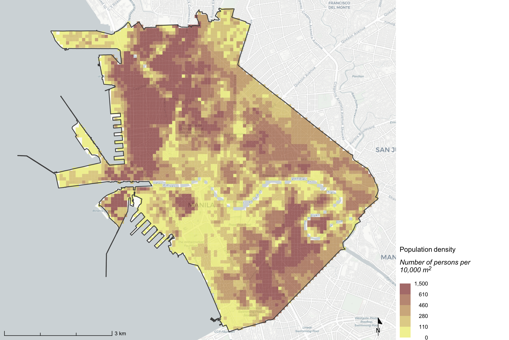{#fig-pop-growth .lightbox height=300}

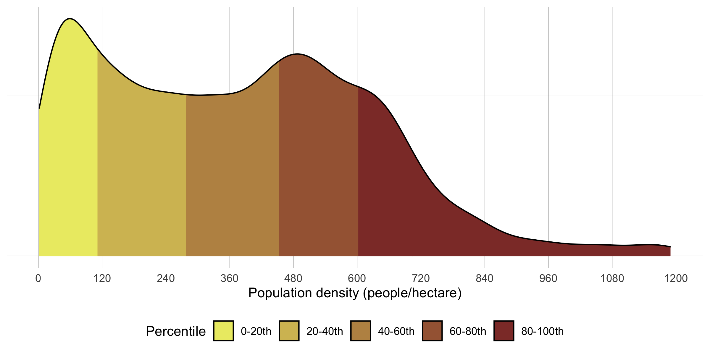{#fig-pop-line .lightbox height=300}
:::

| Dataset | Measurement | Units | Source | Release Year | Years of Data | Coverage | Resolution | Task |
|---------|-------------|-------|--------|--------------|---------------|----------|------------|------|
| WorldPop Global 2 (R2025A) | Population count | People per 100m grid cell | [WorldPop](https://www.worldpop.org/) | 2025 | 2015–2030 | Global | 100m | [tasks/worldpop/](../tasks/worldpop/) |
| WorldPop Global 1 | Population count | People per 1km grid cell | [WorldPop](https://www.worldpop.org/) | 2020 | 2000–2020 | Global | 1km | [tasks/worldpop/](../tasks/worldpop/) |

**What is it?**

A raster map showing estimated residential population counts at 100m resolution for the current year, clipped to the city AOI. Each pixel represents the estimated number of inhabitants within a 100m × 100m (10,000 m<sup>2</sup>) cell. High-density pixels correspond to urban cores and dense residential areas; pixels with zero population represent non-inhabited land.

**Why use it?**

Fine-resolution population density reveals where people actually live within the city — distinguishing dense urban cores, transitional peri-urban zones, and sparsely inhabited areas. Areas of high density signal demand for infrastructure, public services, and transportation; higher density also enables lower cost-per-capita service delivery. For resilience planning, dense areas concentrate exposure to environmental hazards, making density a key input for risk assessments and vulnerability mapping.

**How is this made?**

WorldPop uses a dasymetric disaggregation approach: census population totals from administrative units are redistributed into 100m grid cells using built-settlement layers derived from satellite imagery (the Built-Settlement Growth Model, BSGM). Pixels outside settled areas receive zero population. The population density map uses the Global 2 (R2025A) archive (2015–2030, 100m, constrained). The current-year band is extracted; if the current year falls outside 2015–2030, it is clamped to the nearest available year.

**How should we interpret it?**

High pixel values indicate densely settled areas such as urban cores and residential neighborhoods. Pixels with values ≤ 0 are masked as nodata, representing non-inhabited land (water, forests, agricultural land). Given the 100m resolution and modeled nature of the data, the map provides a high-level spatial overview rather than a census-precise count.

**Under the hood**

[`tasks/worldpop/`](../tasks/worldpop/) downloads rasters from WorldPop directly or from a GCS mirror, handling multi-country AOIs by downloading each country and mosaicking with `rasterio.merge`. The `_stack_mask()` function stacks single-year files into a multi-band archive with band descriptions `pop_{year}`. `analysis.py:compute_stats()` extracts percentiles, mean, sum, and count from the current-year raster. The population density map is rendered in R via [`core/R/`](../core/R/) using the `population` layer definition in [`source/layers.yml`](../source/layers.yml). Charts (e.g., population time series) are produced in [`tasks/worldpop/charts/`](../tasks/worldpop/charts/).

**Key outputs**

- `mnt/{scan-id}/02-process-output/spatial/{city}_population.tif` — single-band current-year raster (100m, G2)
- `mnt/{scan-id}/02-process-output/spatial/{city}_worldpop_2015_2030.tif` — 16-band annual archive (100m, G2)
- `mnt/{scan-id}/02-process-output/spatial/{city}_worldpop_2000_2020.tif` — 21-band annual archive (1km, G1)
- `mnt/{scan-id}/02-process-output/tabular/{city}_population_stats.csv` — summary statistics (min, percentiles, mean, sum, count)
- `mnt/{scan-id}/02-process-output/tabular/{city}_worldpop_2015_2030.csv` — annual G2 population totals per year
- `mnt/{scan-id}/03-render-output/maps/population.png` — raster choropleth map

**Source data citation**

[@bondarenko2020worldpop; @worldpop2025g2]

--------

## Population–Urban Growth Ratio

::: {.callout-note appearance="simple"}
Example chart not yet available — the cross-task analysis (`_pug.csv`) requires both the `worldpop` and `wsf` tasks to have been run first.
:::

| Dataset | Measurement | Units | Source | Task |
|---------|-------------|-------|--------|------|
| WorldPop Global 2 (R2025A) | Population count per year | People | [WorldPop](https://www.worldpop.org/) | [tasks/worldpop/](../tasks/worldpop/) |
| World Settlement Footprint (WSF) | Urban built area per year | km² | [DLR / WSF](https://www.dlr.de/eoc/en/desktopdefault.aspx/tabid-9334/16239_read-40144/) | [tasks/wsf/](../tasks/wsf/) |

**What is it?**

A derived annual time series comparing population growth (%) to urban built area growth (%), producing a Population–Urban Growth Ratio. Values above 1 indicate that the city's population is growing faster than its footprint — densification. Values below 1 indicate sprawl, where land consumption outpaces population growth. The series also includes population density (people per km² of urban area) for each year.

**Why use it?**

Cities that grow by expanding their footprint rather than increasing density tend to be less efficient in service delivery and infrastructure provision, and may signal unsustainable land consumption. Tracking the ratio over time helps planners understand whether growth is being absorbed through densification or through outward expansion.

**How is this made?**

WorldPop multi-year population totals (`_pg.csv`) and WSF harmonized urban built area totals (`_wsf_harmonized.csv`) are joined by year. Year-over-year growth percentages are calculated for both series independently, then divided. A density column (people per km²) is computed as population / urban built area.

**How should we interpret it?**

A ratio consistently above 1 indicates a densifying city with relatively stable or slowly growing urban land. A ratio below 1 suggests land is being developed faster than people are arriving — potentially low-density suburban expansion. Sharp changes in the ratio may reflect data gaps, boundary reclassifications, or rapid development episodes rather than true behavioral shifts.

**Under the hood**

This is a cross-task analysis. The `clean_pug()` function in [`tasks/worldpop/analysis.py`](../tasks/worldpop/analysis.py) reads `_pg.csv` (generated by `clean_pg()` from the WorldPop archive) and `_wsf_harmonized.csv` (from the `wsf` task). Both tasks must be run before this step produces a result. Division-by-zero cases (e.g., zero urban area in early years) are handled gracefully.

**Key outputs**

- `mnt/{scan-id}/02-process-output/tabular/{city}_pg.csv` — annual WorldPop population + year-over-year growth %
- `mnt/{scan-id}/02-process-output/tabular/{city}_pug.csv` — joined table: yearName, population, populationGrowthPercentage, uba (km²), growth_percentage, density, populationUrbanGrowthRatio

--------

## Historical Population (GHS-POP)

::: {.callout-note appearance="simple"}
Example map not yet available in this reference. The task produces `{city}_ghs_pop_E{year}_map.png` per epoch (1975, 1980, ..., 2030) using a magma colormap at 100m resolution.
:::

| Dataset | Measurement | Units | Source | Release Year | Years of Data | Coverage | Resolution | Task |
|---------|-------------|-------|--------|--------------|---------------|----------|------------|------|
| GHS-POP R2023A | Population count | People per 100m grid cell | [EU JRC / GHSL](https://ghsl.jrc.ec.europa.eu/ghs_pop2023.php) | 2023 | 1975–2030 (5-year epochs) | Global | 100m | [tasks/ghs_population/](../tasks/ghs_population/) |

**What is it?**

A raster population dataset from the EU Joint Research Centre's Global Human Settlement Layer (GHSL), providing population estimates at 100m resolution in 5-year snapshots from 1975 to 2030. This offers a longer historical window than WorldPop, making it suitable for multi-decadal trend analysis.

**Why use it?**

Understanding how a city's inhabited footprint has evolved over 45+ years helps contextualize current density patterns and inform long-range growth projections. The long time series is particularly useful for identifying periods of rapid urbanization, post-conflict recovery, or population decline. As an independent dataset from WorldPop, it also serves as a cross-check.

**How is this made?**

GHS-POP redistributes population from censuses into 100m cells using the GHS-BUILT built-up surface layer as a spatial constraint — population is placed only within settled areas. The dataset is produced in the Mollweide equal-area projection (EPSG:54009) and reprojected to EPSG:4326 for City Scan use.

**How should we interpret it?**

Compare epochs (e.g., 1990 vs. 2020) to visualize where population has grown and which areas have remained sparsely settled. Minor discrepancies with WorldPop totals are expected, as the two datasets use different disaggregation methods and source censuses. The 5-year granularity means year-specific events are smoothed.

**Under the hood**

[`tasks/ghs_population/`](../tasks/ghs_population/) loads a tile index shapefile (from GCS or the GHSL website as fallback), identifies intersecting tiles for the AOI, and downloads tile ZIPs in-memory. Tiles are mosaicked with `rasterio.merge`, clipped to the AOI geometry in Mollweide projection, then reprojected to EPSG:4326 using nearest-neighbor resampling. One GeoTIFF is written per epoch. `analysis.py` computes summary statistics per epoch, filtering pixels ≤ 0 as nodata. Per-epoch raster maps and distribution histograms are rendered in Python via [`tasks/ghs_population/visualization.py`](../tasks/ghs_population/visualization.py) and saved to `02-process-output/images/`.

**Key outputs**

- `mnt/{scan-id}/02-process-output/spatial/{city}_ghs_pop_E{year}.tif` — per-epoch raster (one per 5-year step, EPSG:4326, 100m)
- `mnt/{scan-id}/02-process-output/tabular/{city}_ghs_pop_e{year}.csv` — summary statistics (min, percentiles, mean, sum, count) per epoch
- `mnt/{scan-id}/02-process-output/images/{city}_ghs_pop_E{year}_map.png` — raster choropleth map per epoch
- `mnt/{scan-id}/02-process-output/images/{city}_ghs_pop_E{year}_histogram.png` — population distribution histogram per epoch

**Source data citation**

[@schiavina2023ghspop]

--------

## Population Distribution by Age and Sex

::: {layout-ncol=2}
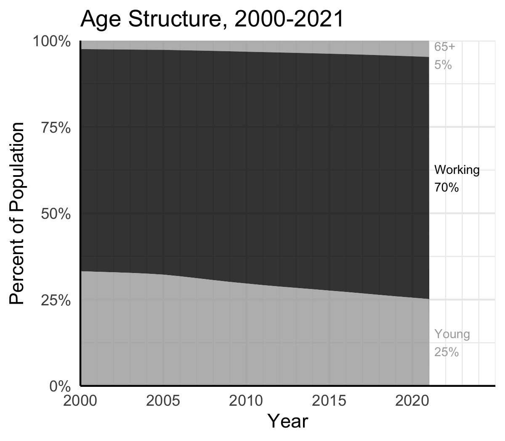{#fig-age-structure .lightbox height=300}

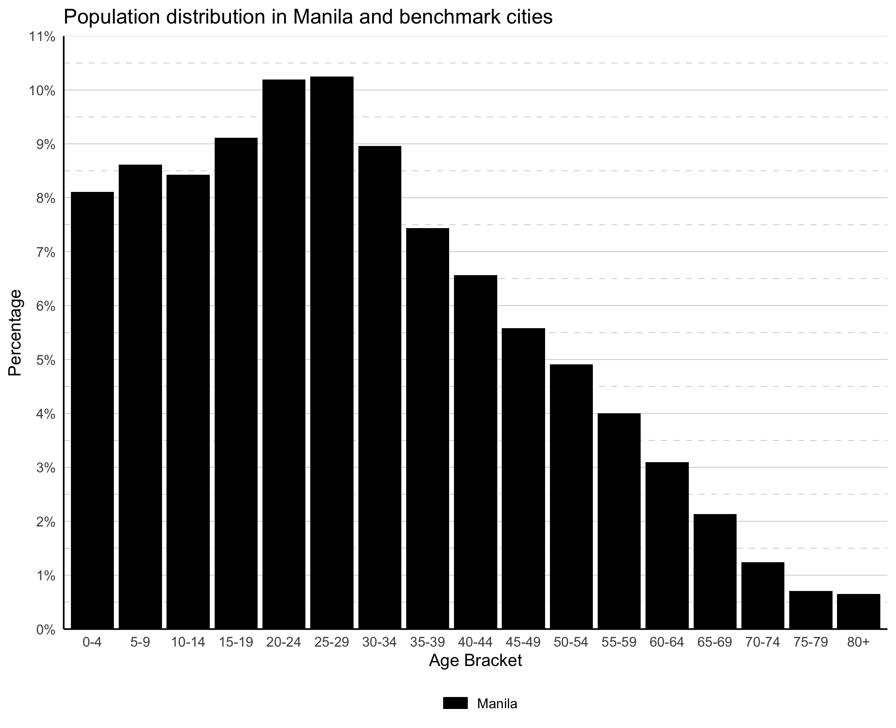{#fig-pop-distro .lightbox height=300}
:::

| Dataset | Measurement | Units | Source | Release Year | Years of Data | Coverage | Resolution | Task |
|---------|-------------|-------|--------|--------------|---------------|----------|------------|------|
| WorldPop R2025A (Age-Sex) | Population count by age group and sex | People | [WorldPop](https://www.worldpop.org/) | 2025 | 2015–2030 | Global | 100m | [tasks/demographics/](../tasks/demographics/) |
| Global Cities Database | Population by age group | People | Oxford Economics | 2022 | 2000–2021 | Global | City-level | [tasks/oxford/](../tasks/oxford/) |

**What is it?**

Two complementary views of the city's age-sex structure:

- **WorldPop demographics** provides a spatially explicit snapshot — a 36-band raster (18 age groups × 2 sexes) at 100m resolution — that can be aggregated to produce an age pyramid, dependency ratios, and key demographic indicators.
- **Oxford Economics age structure** provides a historical time series (2000–2021) showing how the share of Young (0–14), Working (15–64), and Elderly (65+) groups has evolved at the city level.

**Why use it?**

Age-sex structure is a fundamental input for urban planning: schools and pediatric services depend on child population shares; labor market assessments require working-age counts; elderly care infrastructure is driven by the 65+ share. Reproductive-age women (15–49) and youth (15–24) are tracked as distinct policy-relevant groups. Changes in structure over time — visible in the Oxford series — reveal whether a city is in demographic transition.

**How is this made?**

WorldPop R2025A age-sex rasters are downloaded as 36 separate bands covering ages 0–1, 1–4, and 5-year bins up to 80+, for both female (f) and male (m) categories. These are summed per band across all pixels to derive city-level counts. The 0–1 and 1–4 bands are merged into a single 0–4 group before calculating percentages. Dependency ratios are computed as:

- Youth dependency ratio = pop(0–14) / pop(15–64) × 100
- Elderly dependency ratio = pop(65+) / pop(15–64) × 100

Reproductive age is defined as 15–49. Working age is defined as 15–64.

**How should we interpret it?**

A bottom-heavy age pyramid (wider young cohorts) indicates high birth rates and growing future demand for schools and employment. A top-heavy pyramid indicates an aging population with rising demand for healthcare and elderly services. The Oxford time series reveals structural shifts — an expanding working-age share can signal a demographic dividend, while a shrinking one signals future pension and care pressures.

**Under the hood**

[`tasks/demographics/`](../tasks/demographics/) downloads all 36 WorldPop rasters in parallel using `ThreadPoolExecutor` (3 workers). Each band is clipped to the AOI and stacked into a single multi-band GeoTIFF with band descriptions like `f_0-1`, `m_5-9`. `analysis.py` runs three sequential functions: `demographic_aggregate()` converts each band to a population count row; `clean_pas()` merges age groups, expands sex codes to full labels, and computes within-sex percentages; `clean_adr()` calculates youth, elderly, and total dependency ratios. Age distribution charts are produced in [`tasks/demographics/charts/`](../tasks/demographics/charts/) and the age-sex pyramid chart is rendered by [`core/R/chart-age-sex-distribution.R`](../core/R/chart-age-sex-distribution.R).

For Oxford, [`tasks/oxford/collection.R`](../tasks/oxford/collection.R) processes `_oxford_age_structure.csv` (grouped shares over time) and `_oxford_pop_dist.csv` (age distribution snapshot vs. benchmark cities).

**Key outputs**

- `mnt/{scan-id}/02-process-output/spatial/{city}_worldpop_demographics.tif` — 36-band raster (f/m × 18 age groups)
- `mnt/{scan-id}/02-process-output/tabular/{city}_demographic.csv` — per-band population counts (city, sex, age_group, population)
- `mnt/{scan-id}/02-process-output/tabular/{city}_pas.csv` — aggregated age pyramid (ageBracket, sex, count, percentage)
- `mnt/{scan-id}/02-process-output/tabular/{city}_adr.csv` — youth, elderly, and total dependency ratios
- `mnt/{scan-id}/02-process-output/tabular/{city}_oxford_age_structure.csv` — Oxford historical age-group shares 2000–2021
- `mnt/{scan-id}/02-process-output/tabular/{city}_oxford_pop_dist.csv` — Oxford age distribution snapshot vs. benchmarks
- `mnt/{scan-id}/03-render-output/plots/{city}_age_stats.png` — age pyramid chart (static PNG)
- `mnt/{scan-id}/03-render-output/plots/{city}_age_stats.html` — age pyramid chart (interactive)
- `mnt/{scan-id}/03-render-output/plots/world-pop-age-sex.png` — age-sex distribution chart

**Source data citation**

[@bondarenko2020worldpop; @oxford2022global]

--------

## Relative Wealth

::: {layout-ncol=2}
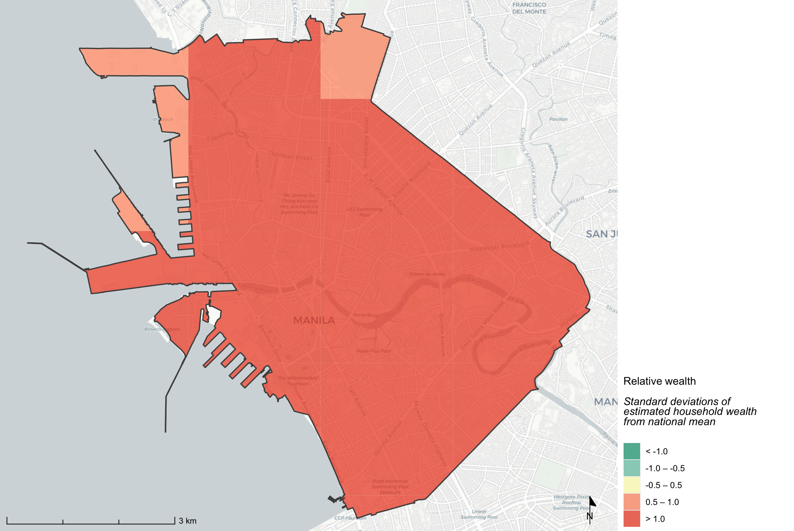{#fig-rwi-std .lightbox height=300}

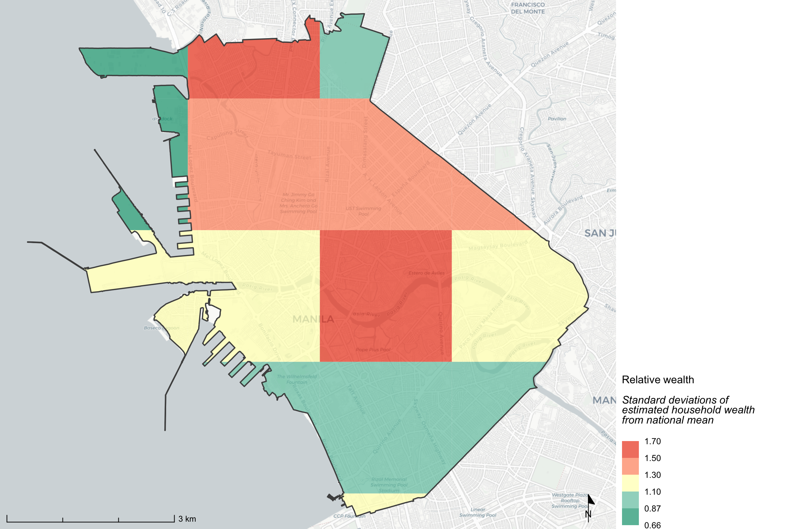{#fig-rwi-rel .lightbox height=300}
:::

::: {layout-ncol=2}
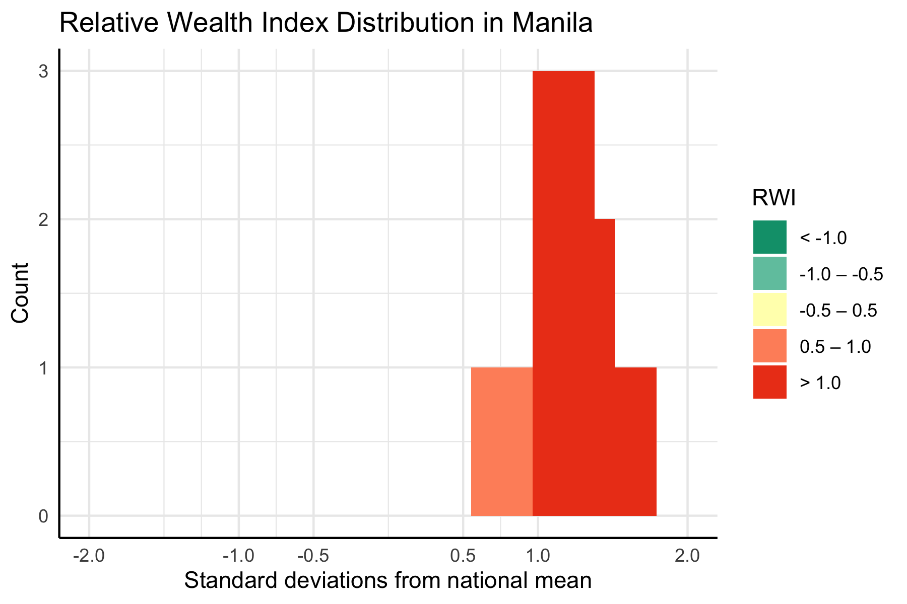{#fig-rwi-hist-std .lightbox height=300}

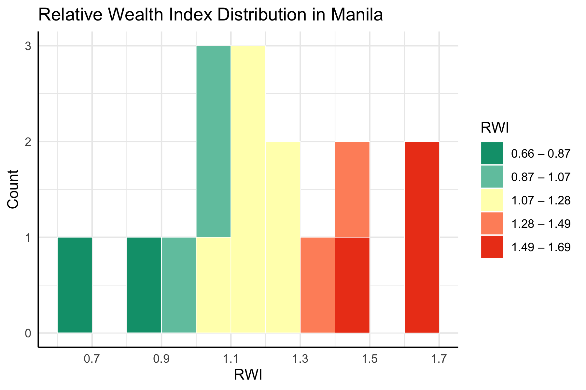{#fig-rwi-hist-rel .lightbox height=300}
:::

| Dataset | Measurement | Units | Source | Release Year | Years of Data | Coverage | Resolution | Task |
|---------|-------------|-------|--------|--------------|---------------|----------|------------|------|
| Relative Wealth Index | Relative wealth score | Z-score (SD units) | [Data for Good at Meta](https://data.humdata.org/dataset/relative-wealth-index) | 2021 | 2021 | ~93 LMICs | ~2.4km | [tasks/rwi/](../tasks/rwi/) |

**What is it?**

A micro-estimate of relative wealth at approximately 2.4km resolution, covering nearly 100 low- and middle-income countries (LMICs). The score is a z-score relative to the country's national distribution — positive values indicate areas wealthier than the national average; negative values indicate poorer areas.

Two categorization schemes are provided:

- **City-relative (5 quantile bins):** Ranks grid cells from "Least Wealthy" to "Most Wealthy" within the city. Useful for identifying intra-city inequality patterns.
- **Standardized (fixed SD breaks):** Uses nationally anchored thresholds (< −1.0, −1.0–0, 0–1.0, > 1.0 SD). Useful for cross-city comparisons and understanding the city's position within the national wealth distribution.

**Why use it?**

Relative wealth identifies spatial patterns of economic disparity that can guide targeted interventions — public investment prioritization, housing programs, and service delivery planning. Areas of concentrated poverty often have compounded vulnerability: lower access to services combined with higher exposure to environmental hazards.

**How is this made?**

The dataset was developed by Meta, based on Demographic and Health Surveys collected on the ground by the United States Agency for International Development (USAID) from 66,819 villages across 56 low- and middle-income countries (LMICS). These surveys served as training data for a model using inputs that include satellite imagery, cellular network data, topography, and Facebook-connectivity data. The model was then used to estimate relative wealth in areas without recent Demographic and Health Surveys. The resulting value is the estimated average household wealth across all households in a given 2.4 km x 2.4 km area, in terms of standard deviations from the national mean. For more information, see the [paper](https://www.pnas.org/doi/10.1073/pnas.2113658119?). 

**How should we interpret it?**

For the standardized map, values near 0 are close to the national median; values above +1 are significantly wealthier and below −1 are significantly poorer than the national average. For the relative map, the five bins show intra-city distribution regardless of national standing — a city that is uniformly poor will still have a "Most Wealthy" bin, which refers only to the wealthiest areas within that city. Cross-region comparisons using only the relative map can therefore be misleading.

**Under the hood**

[`tasks/rwi/`](../tasks/rwi/) downloads the country-level RWI CSV(s) from GCS, builds `Point` geometries from the lat/lon coordinates, projects to Web Mercator (EPSG:3857), and estimates the grid spacing using the median nearest-neighbor distance among all points. Square polygons are constructed around each point using this half-spacing as a buffer. Two categorical columns are added: `wealth_cat_en` (5 quantile bins, city-relative) and `wealth_cat_std` (fixed SD breaks: < −1.0, −1.0–0, 0–1.0, > 1.0). The result is written as a GeoPackage. `analysis.py` computes per-bin area (reprojected to UTM for accuracy) and returns area-weighted histograms for both categorization schemes. Choropleth maps are rendered in R via [`core/R/`](../core/R/) using the `rwi_standardized` and `rwi_relative` layer definitions in [`source/layers.yml`](../source/layers.yml). Distribution charts are produced in [`tasks/rwi/charts/`](../tasks/rwi/charts/).

**Key outputs**

- `mnt/{scan-id}/02-process-output/spatial/{city}_rwi.gpkg` — vector polygons with rwi score, wealth_cat_en, wealth_cat_std
- `mnt/{scan-id}/02-process-output/tabular/{city}_rwi_stats.csv` — summary statistics (min, percentiles, mean, sum, count)
- `mnt/{scan-id}/02-process-output/tabular/{city}_rwi_area.csv` — area-weighted distribution by city-relative bin
- `mnt/{scan-id}/02-process-output/tabular/{city}_rwi_area_standardized.csv` — area-weighted distribution by standardized bin
- `mnt/{scan-id}/03-render-output/maps/rwi_standardized.png` — standardized wealth choropleth map
- `mnt/{scan-id}/03-render-output/maps/rwi_relative.png` — city-relative wealth choropleth map
- `mnt/{scan-id}/03-render-output/plots/rwi-histogram-standardized.png` — standardized wealth distribution chart
- `mnt/{scan-id}/03-render-output/plots/rwi-histogram-relative.png` — city-relative wealth distribution chart

**Source data citation**

[@chi2022microestimates]