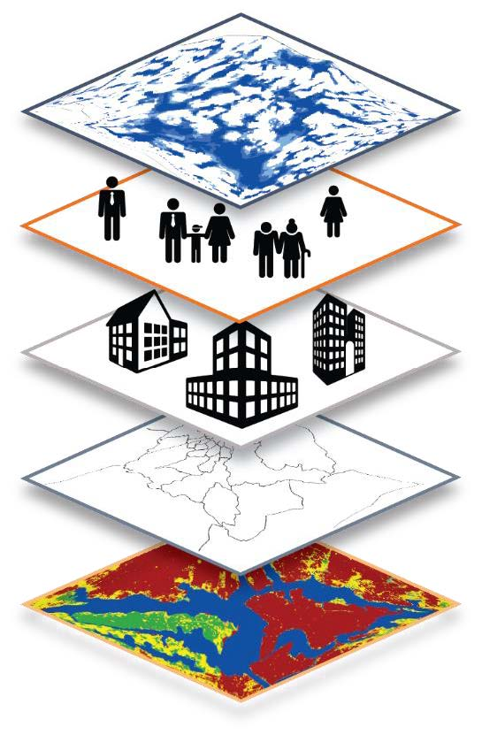

# What is City Scan?

::: {.columns}

::: {.column width="30%"}
{fig-alt="High-level conceptual illustration of the City Scan system." width="60%"}
:::

::: {.column width="70%"}
A City Scan is a rapid geospatial assessment of a city's demographic, socioeconomic, climate, and risk conditions. It is a collection of maps and charts made from global and publicly available datasets that provide quick high-level insights into resilience-related topics for a city. The output is a package of maps, data visualizations and insights that integrate features of both the built and natural environments. These scans are especialy useful for grounding early-stage conversations in geospatial data.
:::

::: 

## What can the City Scan tell me?

This City Scan is intended to support operational teams in building dialogue around a city’s most pressing resilience challenges. It is designed as a conversation starter rather than a specific decision making tool. Thinking spatially about how urbanization affects the resilience of various urban forces, networks, and people helps equip officials to develop risk informed investment proposals, identify opportunities and barriers to unlocking private capital, and prioritize and coordinate future investments.

## Guiding questions to keep in mind

- How might investment priorities differ in different parts of the city based on this data?
-  What spatial relationships are surprising?
-  What questions does this spatial pattern spur?
-  Where else have you worked that is reminiscent of these findings? 
- What might be applicable from there? What might not be?

## Why invest in urban resilience

Investing in urban resilience boosts long-term economic, social, and
physical sustainability by safeguarding the gains from current developments
for future generations. Greater urban resilience builds the
capacity of local governments to help households, communities, and
enterprises manage and avoid shocks and stresses, for example by
damage-proofing infrastructure before a disaster or maintaining critical
services afterward. This approach represents a significant shift
from prior development trends, which concentrated investments on
post-disaster reconstruction and recovery.

::: {.callout-note}
For a hands-on introduction, see [Running Your First City Scan](running-first-cityscan.qmd).
:::
